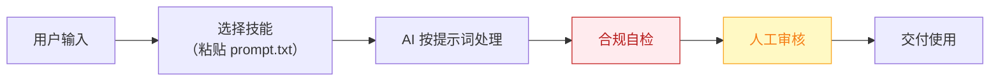

# 评论运营官 — 业务架构

## 四层视图

```mermaid
flowchart TD
    subgraph L1["① 用户层"]
        U["万粉以上创作者（评论量达到人工处理瓶颈的阈值）"]
    end

    subgraph L2["② 数字员工层"]
        E["评论运营官<br/>把评论区从"成本中心"变成"选题矿藏"的运营副手"]
    end

    subgraph L3["③ 工作流层（4 条）"]
        W1["每日评论聚合分类"]
        WN["…共 4 条"]
    end

    subgraph L4["④ 原子技能层（6 个）"]
        SK1["评论情感分析"]
        SK2["高频问题聚类"]
        SK3["回复话术生成"]
        SK4["粉丝分层打标"]
        SK5["选题知识库"]
        SK6["人设语气库"]
    end

    U -->|"提出需求"| E
    E -->|"编排调用"| W1
    W1 --> WN
    W1 --> SK1

    style L1 fill:#E8F4FD,stroke:#1976D2,color:#0D47A1
    style L2 fill:#FFF3E0,stroke:#E65100,color:#BF360C
    style L3 fill:#F3E5F5,stroke:#7B1FA2,color:#4A148C
    style L4 fill:#E8F5E9,stroke:#388E3C,color:#1B5E20
```

## 资产形态说明

本资产包为**纯提示词客户端资产**：

| 特性 | 说明 |
|------|------|
| 无运行时依赖 | 不调用任何模型 API，不需要 API Key |
| 平台无关 | 提示词为纯文本，可导入任意主流 AI 平台 |
| 用户自备算力 | 模型由用户自己的订阅提供 |
| 零服务端成本 | 资产方不产生任何调用费用 |

## 数据流



> **关键设计**：所有对外输出必须经过「合规自检 → 人工审核」双闸门。

## 能力边界

| 维度 | 内容 |
|------|------|
| **目标用户** | 万粉以上创作者（评论量达到人工处理瓶颈的阈值） |
| **做** | 评论聚合分类、高频问题提取转选题、回复话术草稿、铁粉打标 |
| **不做** | 不做：自动直接发布回复（草稿必须人工确认后发出，规避人设翻车与平台风控）、不处理涉诉/公关危机评论 |
| **KPI** | 评论处理时长从 1-2h 压缩至 ≤20 分钟；高频问题→选题转化率 ≥10%/周；回复人设一致性质检通过率 ≥95% |
| **定价** | ¥30-60/月（据 R2 调研估算，蓝海无直接竞品） |

---

*本图由 build_p0_assets.py 自动生成*
