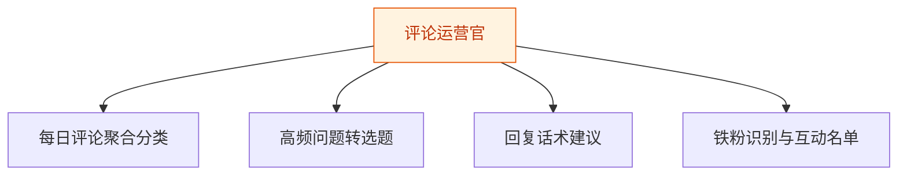
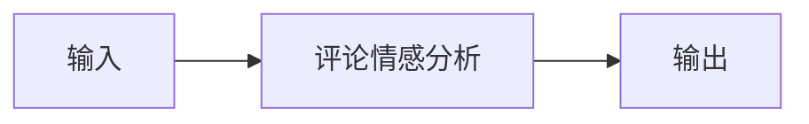
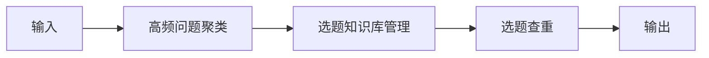
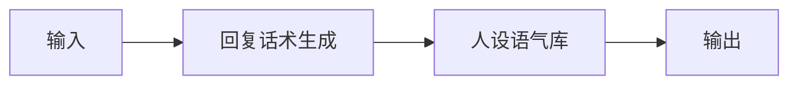
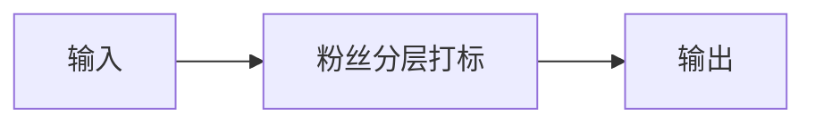

# 评论运营官 — 工作流流程图

本员工共 **4 条工作流**，下辖 **6 个原子技能**。

## 总览

## 分条详情

### 每日评论聚合分类

| 项目 | 内容 |
|------|------|
| 触发 | 定时（每日 21:00） |
| 复杂度 | `M` |
| 阶段 | `P0` |
| ROI | 评论处理 1-2h→20min，月省约 30h×¥30≈¥900 vs ¥30-60 |

### 高频问题转选题

| 项目 | 内容 |
|------|------|
| 触发 | 事件（WF1 后自动） |
| 复杂度 | `M` |
| 阶段 | `P0` |
| ROI | 闭环核心：评论区选题免费且精准，直接缓解第一痛点（选题枯竭） |

### 回复话术建议

| 项目 | 内容 |
|------|------|
| 触发 | 人工/事件 |
| 复杂度 | `S` |
| 阶段 | `P0` |
| ROI | 含于 WF1 工时；互动率提升带来流量加权的间接收益 |

### 铁粉识别与互动名单

| 项目 | 内容 |
|------|------|
| 触发 | 定时（每周） |
| 复杂度 | `S` |
| 阶段 | `P1` |
| ROI | 铁粉名单直接输送给 4 私域转化师，为私域增收供弹药 |

## 汇总表

| # | 工作流 | 阶段 | 复杂度 | 触发 | 涉及技能数 |
|---|--------|------|--------|------|-----------|
| 1 | 每日评论聚合分类 | `P0` | `M` | 定时（每日 21:00） | 1 |
| 2 | 高频问题转选题 | `P0` | `M` | 事件（WF1 后自动） | 3 |
| 3 | 回复话术建议 | `P0` | `S` | 人工/事件 | 2 |
| 4 | 铁粉识别与互动名单 | `P1` | `S` | 定时（每周） | 1 |

---

*本图由 build_p0_assets.py 自动生成*
