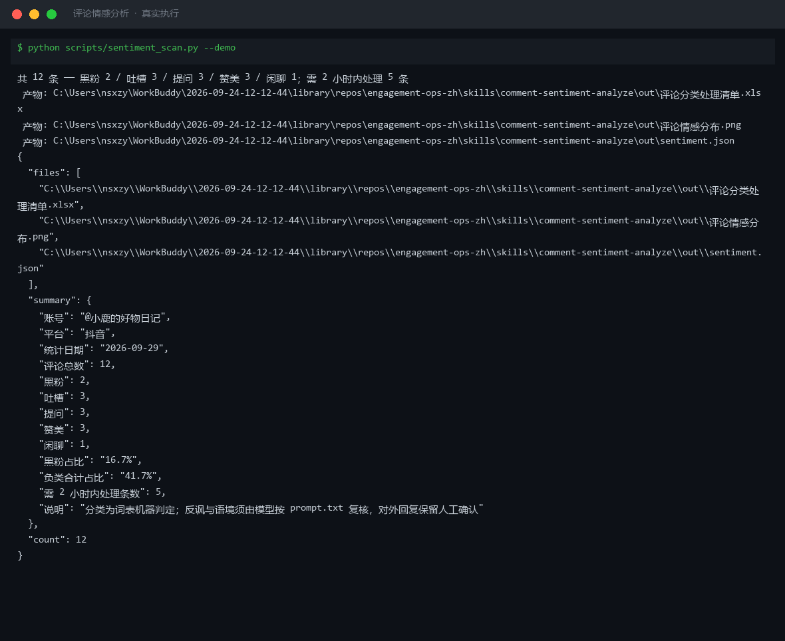
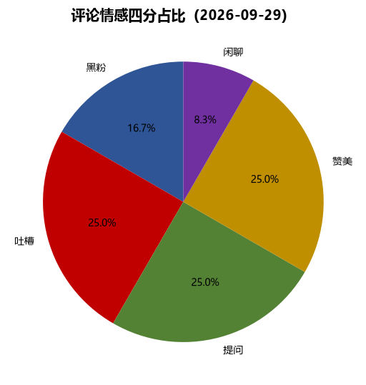
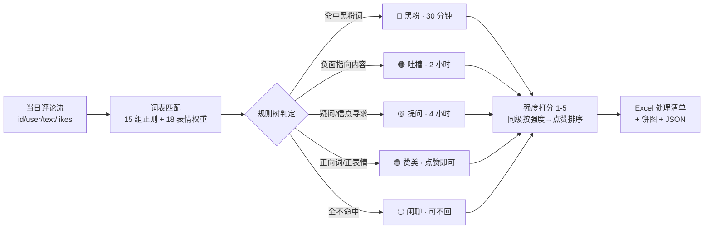

# 评论情感分析 Comment Sentiment Analyze

> 原子技能 ｜ 属于「评论运营官」 ｜ 自媒体创作者客群 ｜ T1 产物型（脚本交付真实文件）
>
> **把一天涌进来的评论按 SLA 排好队：先救火（黑粉 30 分钟），再答疑，最后闲聊。**
> 15 组词表正则 + 18 个表情权重 · 四分类（提问/赞美/吐槽/黑粉）+ 闲聊兜底 · 情绪强度 1-5 打分 · 5 级 SLA 一次排好




🎬 **[▶ 观看高清完整版（mp4）](https://cdn.jsdelivr.net/gh/bangwozuo/engagement-ops-zh@main/skills/comment-sentiment-analyze/docs/assets/demo.mp4)** — 四幕数据叙事：业务钩子 → 真实执行 → 指标条形图生长 → 交付物

*上图来自真实执行：12 条内置样例评论 → 黑粉 2 / 吐槽 3 / 提问 3 / 赞美 3 / 闲聊 1，5 条需 2 小时内处理，产物落盘 Excel + PNG + JSON。*

---

## 它怎么判（四分类，每类有硬标准，不看感觉）

### 判定规则树（命中即停，黑粉最优先）

| 优先级 | 类别 | 判定标准（词表节选） | 处理时限（SLA） |
|---|---|---|---|
| 1 | 🔴 黑粉 | 人身攻击（垃圾/废物/滚）· 动机质疑（骗子/恰烂饭/水军/割韭菜）· 恶意扩散（举报你/都别买/脱粉回踩/塌房） | **30 分钟内**：澄清一次 + 视情节隐藏/举报，禁止对线 |
| 2 | 🟠 吐槽 | 负面指向内容/产品：失望/退步/水了/划水/广告太多/讲得乱/翻车/智商税 | 2 小时内：真诚致歉 + **具体**改进点 |
| 3 | 🟡 提问 | 强线索（？/怎么/多少/求/蹲）单独立判；弱线索（链接/色号/价格）须无赞美佐证 | 4 小时内：给答案或「已记录，X 小时内补答案」 |
| 4 | 🟢 赞美 | 正向词（绝了/爱了/学到了/码住/三连）或 🙂❤️👍🔥 | 点赞即可，高赞置顶 |
| 5 | ⚪ 闲聊 | 以上全不命中 | 可不回，每 2 小时集中扫 |

**防误判设计**：「这个色号也太好看了」含弱线索词「色号」但有正表情佐证 → 判赞美不判提问；吐槽 + 疑问混合归吐槽并标注「含问题需一并回复」。

### 情绪强度 1-5 分（量化，非拍脑袋）

强度 = 1 + 命中词权重累加 + 表情权重（😡🤬 计 2，😭😤😒💀 计 1）+ 重复标点（！！/？？）+1，封顶 5。强度 4-5 的吐槽/黑粉是「临近爆发」信号，SLA 内最先处理。

## 真实输入 → 真实输出

**输入**（`examples/input.json`，抖音账号单日评论流）：

```json
{
  "account": "@小鹿的好物日记",
  "platform": "抖音",
  "date": "2026-09-29",
  "comments": [
    {"id": "C003", "user": "黑粉本粉", "text": "就是骗子！收钱恰烂饭，大家都别买，我去举报了😡", "likes": 1},
    {"id": "C009", "user": "失望集合体", "text": "最近内容真的退步了，不如以前用心，很失望😭", "likes": 15}
  ]
}
```

**输出**（脚本实跑，12 条处理队列节选）：

| 评论ID | 用户 | 类别 | 强度 | 处理时限(SLA) | 命中依据 |
|---|---|---|---|---|---|
| C010 | 杠精附体 | 🔴 黑粉 | 5 | 30 分钟内 | 黑粉词：垃圾；搬运狗；人设崩塌 |
| C009 | 失望集合体 | 🟠 吐槽 | 5 | 2 小时内 | 吐槽词：退步/不如以前/失望；强负表情：😭 |
| C005 | 打工人小王 | 🟠 吐槽 | 5 | 2 小时内 | 吐槽词：划水/广告太多；含问题需一并回复 |
| C004 | cccccc | 🟢 赞美 | 4 | 点赞即可 | 赞美词：绝了；正表情：❤️ |

完整 12 条见 [`examples/output.md`](examples/output.md)；产物三件套：



- `out/评论分类处理清单.xlsx`（处理队列，黑粉标红 + 汇总两个 sheet）
- `out/评论情感分布.png`（四分类占比饼图，上图）
- `out/sentiment.json`（机器可读，供工作流读取）

## 处理流水线



## 快速开始

**方式一：提示词（任意 AI 工具）**

```text
1. 打开 prompt.txt，全文复制
2. 粘贴到 Coze / WorkBuddy / Dify / Claude / ChatGPT
3. 按 schema.json 的输入规格提供：账号评论流（id/user/text/likes）
```

**方式二：脚本（零 AI 依赖，确定性分类）**

```bash
# 演示模式（内置 12 条真实样例）
python scripts/sentiment_scan.py --demo
# 指定输入
python scripts/sentiment_scan.py --input examples/input.json --outdir out
```

依赖：`pip install openpyxl`（缺失时脚本会打印修复命令，不静默失败）。

## 面向谁 / 什么时候用

| ✅ 该用 | ❌ 别用 |
|---|---|
| 评论量达到人工处理瓶颈的创作者，每天先救火再闲聊 | 替代人工审核——反讽、阴阳怪气、老粉玩笑必须模型复核 |
| 批量评论的 SLA 排序与优先级决策 | 与黑粉对线——脚本只给澄清建议，不输出反驳话术 |
| 需要每条判定都带「命中依据」可追溯 | 抓取需登录的私域数据（只吃平台后台导出或人工粘贴） |

## 边界与合规

- 本资产输出为 **AI 辅助生成内容**，对外回复（澄清/致歉/答案）发布前必须人工确认
- 词表机器判定 ≠ 终判：反讽、老粉玩笑（熟 ID 的「垃圾，更新太慢了」）由模型按 prompt.txt 复核，改分类必须给依据
- 隐藏/举报动作由人工在平台后台执行；用户昵称与评论内容不出本账号运营范围

## 文件地图

```text
├── README.md                    ← 本文件
├── SKILL.md                     ← 资产定义（元信息 / 契约 / 边界）
├── prompt.txt                   ← 提示词本体（四分类硬标准 + 强度打分 + 禁止事项）
├── schema.json                  ← 输入输出契约（机器可读）
├── scripts/sentiment_scan.py    ← 确定性分类脚本（词表 → Excel/PNG/JSON）
├── examples/                    ← 真实输入 + 脚本实跑输出
├── docs/                        ← 9 项配套文档（架构 / 流程 / 场景 / 测试报告…）
└── out/                         ← 实跑产物（评论分类处理清单.xlsx / 评论情感分布.png / sentiment.json）
```

---

*本资产遵循 [bangwozuo 数字员工资产规范](https://github.com/bangwozuo/digital-employee-spec) v3.0 ｜ [所属员工：评论运营官](../../) ｜ [总入口](https://github.com/bangwozuo/digital-employees-hub-zh)*
