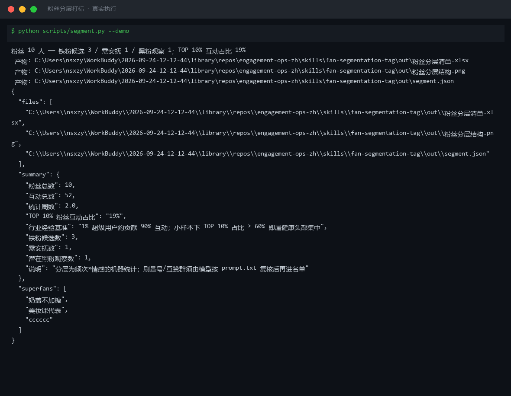
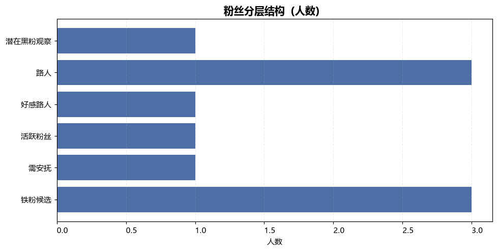
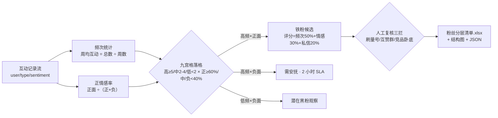

# 粉丝分层打标 Fan Segmentation Tag

> 原子技能 ｜ 属于「评论运营官」 ｜ 自媒体创作者客群 ｜ T1 产物型（脚本交付真实文件）
>
> **把互动记录换算成「频次 × 情感」九宫格，告诉你该感谢谁、安抚谁、拉黑谁。**
> 3×3 量化九宫格（高频 ≥5 次/周 × 正情感率 ≥60%）· 铁粉评分 0-100（频次 50% + 情感 30% + 私信深度 20%）· TOP 10% 集中度健康基准（≥60%）· 刷量号/互赞群人工复核拦截




🎬 **[▶ 观看高清完整版（mp4）](https://cdn.jsdelivr.net/gh/bangwozuo/engagement-ops-zh@main/skills/fan-segmentation-tag/docs/assets/demo.mp4)** — 四幕创作叙事：业务钩子 → 真实执行 → 要点到成稿演变 → 交付物

*上图来自真实执行：2 周互动数据、6 名粉丝 → 铁粉候选 2 / 需安抚 1 / 黑粉观察 1，TOP 10% 互动占比 28%（<60% 健康线，判定为核心粉沉淀期），产物落盘 Excel + PNG + JSON。*

---

## 它怎么分（全部量化，不留「看感觉」空间）

### 维度一：互动频次（次/周）＝ 总互动 ÷ 周数（评论+点赞+私信+转发+收藏）

| 档位 | 阈值 | 含义 |
|---|---|---|
| 高频 | ≥ 5 次/周 | 铁粉候选的硬门槛 |
| 中频 | 2-4 次/周 | 稳定关注，值得培养 |
| 低频 | < 2 次/周 | 偶尔路过 |

### 维度二：情感倾向（正情感率）＝ 正面 ÷（正面+负面），引用评论情感分析的四分类结果

| 档位 | 阈值 |
|---|---|
| 正面 | ≥ 60% |
| 中性 | 40% - 60% |
| 负面 | < 40% |

### 九宫格落格 → 动作（节选）

| 频次 \ 情感 | 正面 ≥60% | 负面 <40% |
|---|---|---|
| 高频 ≥5/周 | **铁粉候选**：感谢+福利（人工确认后私信） | **需安抚**：2 小时内回复致歉+改进点 |
| 中频 2-4/周 | 活跃粉丝：点赞+偶尔翻牌 | 预警观察：连续 2 周负面升级处理 |
| 低频 <2/周 | 好感路人：内容触达 | 潜在黑粉观察：只记录不互动 |

**铁粉评分**（0-100）= 频次分×50% + 正情感率×30% + 私信深度×20%；**≥70 才能进「内容共创/试用邀约」层**，<70 只做感谢与福利。集中度基准：TOP 10% 粉丝互动占比 ≥60% 健康；<30% 说明没有核心粉丝群，先做互动钩子再谈分层。

## 真实输入 → 真实输出

**输入**（`examples/input.json`，2 周互动记录）：

```json
{
  "account": "@小鹿的好物日记",
  "weeks": 2,
  "interactions": [
    {"user": "奶盖不加糖", "type": "comment", "sentiment": "pos"},
    {"user": "奶盖不加糖", "type": "dm", "sentiment": "neutral"},
    {"user": "打工人小王", "type": "comment", "sentiment": "neg"}
  ]
}
```

**输出**（脚本实跑，10 名粉丝明细节选，按铁粉评分降序）：

| 用户 | 周均互动 | 频次档 | 正情感率 | 分层标签 | 铁粉评分 |
|---|---|---|---|---|---|
| 奶盖不加糖 | 5.0 | 高频 | 100% | 铁粉候选 | 75.7 |
| cccccc | 5.0 | 高频 | 100% | 铁粉候选 | 65.7 |
| 打工人小王 | 5.0 | 高频 | 0% | 🔴 需安抚 | 35.7 |
| 今天也很困 | 0.5 | 低频 | 0% | 潜在黑粉观察 | 3.5 |

完整 10 人见 [`examples/output.md`](examples/output.md)；产物三件套：



- `out/粉丝分层清单.xlsx`（分层明细 + 铁粉名单 + 汇总三个 sheet）
- `out/粉丝分层结构.png`（分层结构图，上图）
- `out/segment.json`（机器可读，供工作流读取）

## 处理流水线



## 快速开始

**方式一：提示词（任意 AI 工具）**

```text
1. 打开 prompt.txt，全文复制
2. 粘贴到 Coze / WorkBuddy / Dify / Claude / ChatGPT
3. 按 schema.json 的输入规格提供：互动记录（user/type/sentiment）+ 统计周数
```

**方式二：脚本（零 AI 依赖，确定性分层）**

```bash
# 演示模式（内置 2 周真实样例）
python scripts/segment.py --demo
# 指定输入
python scripts/segment.py --input examples/input.json --outdir out
```

依赖：`pip install openpyxl`（缺失时脚本会打印修复命令，不静默失败）。

## 面向谁 / 什么时候用

| ✅ 该用 | ❌ 别用 |
|---|---|
| 把有限互动时间花在对的人身上（感谢/安抚/观察三张名单） | 统计周期 <2 周的数据——一条爆款就能刷出「伪高频」 |
| 铁粉候选筛选与内容共创邀约（评分 ≥70） | 公开粉丝名单或「只回铁粉」表态——塌房素材 |
| 移交私域转化环节前的名单初筛 | 给疑似刷量号/互赞群发福利——预算烧在假粉丝上 |

## 边界与合规

- 本资产输出为 **AI 辅助生成内容**，名单移交私域前必须人工确认
- 粉丝昵称与互动记录属用户数据，仅用于本账号运营，不导出第三方；名单不进群、不外发
- 触达动作（私信/进群/福利）零自动化，全部人工执行；平台对陌生人私信有限流，优先评论区翻牌

## 文件地图

```text
├── README.md                 ← 本文件
├── SKILL.md                  ← 资产定义（元信息 / 契约 / 边界）
├── prompt.txt                ← 提示词本体（九宫格阈值 + 评分公式 + 失败模式）
├── schema.json               ← 输入输出契约（机器可读）
├── scripts/segment.py        ← 确定性分层脚本（九宫格 → Excel/PNG/JSON）
├── examples/                 ← 真实输入 + 脚本实跑输出
├── docs/                     ← 9 项配套文档（架构 / 流程 / 场景 / 测试报告…）
└── out/                      ← 实跑产物（粉丝分层清单.xlsx / 粉丝分层结构.png / segment.json）
```

---

*本资产遵循 [bangwozuo 数字员工资产规范](https://github.com/bangwozuo/digital-employee-spec) v3.0 ｜ [所属员工：评论运营官](../../) ｜ [总入口](https://github.com/bangwozuo/digital-employees-hub-zh)*
