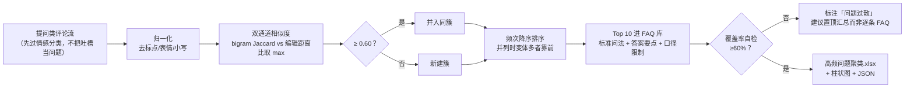

# 高频问题聚类 FAQ Cluster

> 原子技能 ｜ 属于「评论运营官」 ｜ 自媒体创作者客群 ｜ T1 产物型（脚本交付真实文件）
>
> **把「求链接！」和「求链接」合并成一个问题簇，让一条置顶 FAQ 回答一百个人。**
> 双通道相似度（字符 bigram Jaccard + 编辑距离比取最大）· 合并阈值 0.60（宁可漏合不可错合）· 贪心聚类按频次排 Top 10 · 覆盖率自检（<60% 判问题过散）


🎬 **[▶ 观看高清完整版（mp4）](https://cdn.jsdelivr.net/gh/bangwozuo/engagement-ops-zh@main/skills/faq-cluster/docs/assets/demo.mp4)** — 四幕流转叙事：业务钩子 → 真实执行 → 数据管线节点动画 → 交付物

*上图来自真实执行：23 条提问 → 归一化 22 个独立问法 → 13 簇，Top 10 覆盖率 87%（≥60% 下限，判定正常），产物落盘 Excel + PNG + JSON。*

---

## 它怎么聚（四步，每步可执行）

| 步骤 | 处理 | 关键参数 |
|---|---|---|
| 1. 归一化 | 去标点/表情/空白，统一小写 | 「求链接！」=「求链接」 |
| 2. 相似度 | 字符 bigram Jaccard（对中文短句敏感）+ difflib 编辑距离比（容忍错别字/语序颠倒），**取两者最大值** | ≥ 0.60 归同簇；低于它「油皮能用吗」和「油皮会闷痘吗」不会被错并（两者答案不同） |
| 3. 贪心聚类 | 按频次从高到低建簇，新问题与簇代表比相似度；频次并列时**簇内变体多者靠前**（问法发散更值得写 FAQ） | 按簇总频次降序输出 |
| 4. Top 10 进 FAQ 库 | 每簇给标准问法 + 可直接粘贴的答案要点 + 回复口径限制 | 覆盖率 = Top10 覆盖题数 ÷ 总提问数，**<60% 判「问题过散」需复核** |

### 答案要点撰写口径（不是空话）

问渠道 → 只给平台内路径（**禁止导流站外**）；问价格 → 给区间与查询口径（**禁止承诺最低价**）；问肤质/功效 → 适用性说明 + 「严重问题建议就医」（**禁止效果承诺**）；结尾带钩子（「更详细的在置顶视频」）。

## 真实输入 → 真实输出

**输入**（`examples/input.json`，一周提问类评论）：

```json
{
  "account": "@小鹿的好物日记",
  "period": "2026-09-23 ~ 2026-09-29",
  "questions": ["在哪买", "在哪买啊", "姐妹在哪买", "求链接", "求个链接", "求链接！", "多少钱", "这个多少钱"]
}
```

**输出**（脚本实跑，高频问题榜节选）：

| 排名 | 标准问法 | 变体数 | 频次 | 占比 | 建议答案要点（节选） |
|---|---|---|---|---|---|
| Q01 | 求链接 | 2 | 3 | 13% | 平台橱窗链接位置 + 备选渠道，不引导站外交易 |
| Q03 | 多少钱 | 3 | 3 | 13% | 价格区间 + 活动价/日常价分开说明，不承诺最低价 |
| Q04 | 油皮能用吗 | 2 | 2 | 9% | 按肤质说明适用性，注明仅为经验分享、严重问题建议就医 |

完整 Top 10 见 [`examples/output.md`](examples/output.md)。**聚类效果可核对**：「求链接/求个链接/求链接！」正确归并；「贵不贵」与「多少钱」**未合并是正确行为**——价格 vs 值不值，答案口径不同。产物三件套：


- `out/高频问题聚类.xlsx`（问题簇明细 + FAQ 库 Top10 含答案要点 + 汇总）
- `out/faq_top10.png`（Top 10 频次柱状图，上图）
- `out/faq_cluster.json`（机器可读，供工作流读取）

## 处理流水线



## 快速开始

**方式一：提示词（任意 AI 工具）**

```text
1. 打开 prompt.txt，全文复制
2. 粘贴到 Coze / WorkBuddy / Dify / Claude / ChatGPT
3. 按 schema.json 的输入规格提供：提问类评论列表（先经情感分类筛选）
```

**方式二：脚本（零 AI 依赖，确定性聚类）**

```bash
# 演示模式（内置 23 条真实提问）
python scripts/faq_cluster.py --demo
# 指定输入
python scripts/faq_cluster.py --input examples/input.json --outdir out
```

依赖：`pip install openpyxl`（缺失时脚本会打印修复命令，不静默失败）。

## 面向谁 / 什么时候用

| ✅ 该用 | ❌ 别用 |
|---|---|
| 从「逐条回答重复问题」变成「一条置顶 FAQ 回答一百个人」 | 把吐槽当问题聚——「有没有不这么水的版本」不是 FAQ |
| 每周 FAQ 库更新 + 覆盖率自检 | 合并答案不同的相似问法（「多少钱」vs「为什么这么贵」） |
| 单簇频次 ≥ 总量 30% 时直接置顶或做视频回应 | 在答案里导流站外或承诺效果（加微信发链接 = 违规） |

## 边界与合规

- 本资产输出为 **AI 辅助生成内容**，FAQ 口径（尤其价格与功效类）发布前必须人工确认
- 语义近但用词完全不同的问法（「怎么入手」vs「如何购买」）由模型二次合并并给语义依据；脚本判不进同簇的不能凭语感硬合
- FAQ 库每月校对一次：平台改版后旧口径会变成错误答案；用户评论数据仅限本账号运营使用

## 文件地图

```text
├── README.md                  ← 本文件
├── SKILL.md                   ← 资产定义（元信息 / 契约 / 边界）
├── prompt.txt                 ← 提示词本体（聚类四步法 + 答案口径 + 失败模式）
├── schema.json                ← 输入输出契约（机器可读）
├── scripts/faq_cluster.py     ← 确定性聚类脚本（双通道相似度 → Excel/PNG/JSON）
├── examples/                  ← 真实输入 + 脚本实跑输出
├── docs/                      ← 9 项配套文档（架构 / 流程 / 场景 / 测试报告…）
└── out/                       ← 实跑产物（高频问题聚类.xlsx / faq_top10.png / faq_cluster.json）
```

---

*本资产遵循 [bangwozuo 数字员工资产规范](https://github.com/bangwozuo/digital-employee-spec) v3.0 ｜ [所属员工：评论运营官](../../) ｜ [总入口](https://github.com/bangwozuo/digital-employees-hub-zh)*
