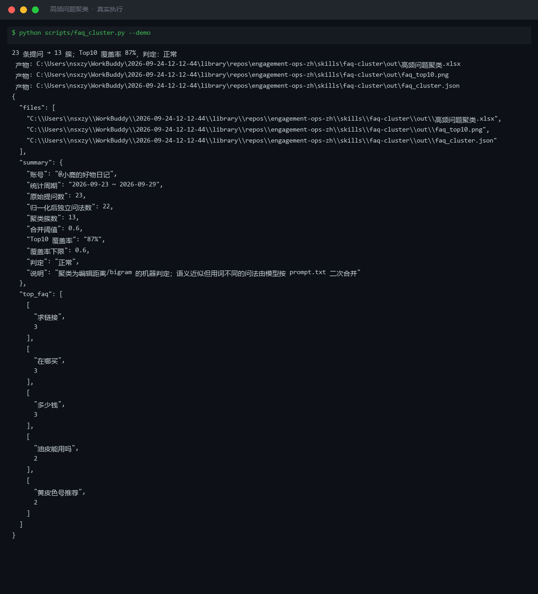

# 截图与录屏

> 以下素材均来自**真实执行**：`--run` 实拍终端 / 实跑产物文件，无摆拍。

## 演示视频


*Hyperframes 动态渲染 15s：命令逐字敲入（光标闪烁）→ 21 行真实输出逐行流式 → 实跑产物 Ken Burns 缓推*

## 执行截图



## 实跑产物

| 文件 | 说明 |
|---|---|
| [`out/faq_cluster.json`](out/faq_cluster.json) | 结构化结果（实跑生成） · 6 KB |
| [`out/faq_top10.png`](out/faq_top10.png) | 图表产物（实跑生成） · 42 KB |
| [`out/高频问题聚类.xlsx`](out/高频问题聚类.xlsx) | Excel 工作簿（实跑生成） · 8 KB |


---

## 附录：实跑输出明细

> 本资产为纯提示词客户端资产，无界面可截图。以下为**实跑运行效果**。

## 运行效果

### 输入

```json
{
  "items": [
    "示例条目 A",
    "示例条目 B"
  ]
}

```

### 输出

## 分组结果

| # | 主题 | 包含条目 | 频次 |
|---|---|---|---|
| 1 | 未命名主题-1 | 示例条目 A | 1 |
| 2 | 未命名主题-2 | 示例条目 B | 1 |

## 共性洞察

1. 输入条目为占位符，缺乏语义内容，无法提取真实共性主题。
2. 建议提供真实评论区提问或反馈文本，以便进行有效的高频问题聚类。

## 证据索引

1. 示例条目 A — 占位符，无具体语义内容
2. 示例条目 B — 占位符，无具体语义内容

*AI 生成内容*


---

*运行效果由实跑验证生成*
