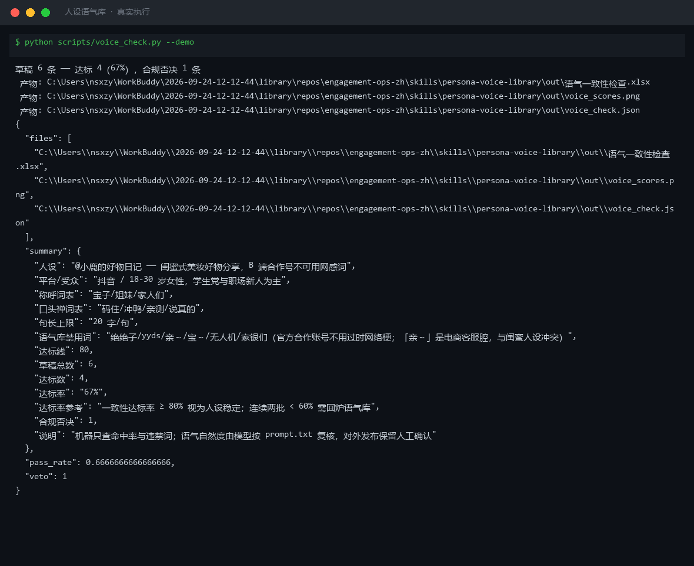
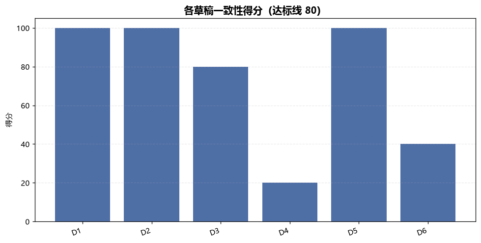
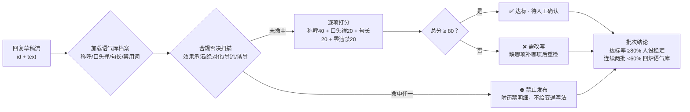

# 人设语气库 Persona Voice Library

> 原子技能 ｜ 属于「评论运营官」 ｜ 自媒体创作者客群 ｜ T1 产物型（脚本交付真实文件）
>
> **先建一份可执行的语气库档案，再逐条检查回复草稿——一条出戏的回复毁掉十条用心的视频。**
> 档案 6 字段（称呼/口头禅/句长上限/禁用词…）· 一致性检查满分 100（称呼 40 + 口头禅 20 + 句长 20 + 零违禁 20）· 达标线 80 · 合规否决一票制（效果承诺/绝对化用语/站外导流/诱导互动）



🎬 **[▶ 观看演示视频（在线播放）](https://cdn.jsdelivr.net/gh/bangwozuo/engagement-ops-zh@main/skills/persona-voice-library/docs/assets/demo.mp4) · [GitHub 页](https://github.com/bangwozuo/engagement-ops-zh/blob/main/skills/persona-voice-library/docs/assets/demo.mp4)** — 四幕创作叙事：业务钩子 → 真实执行 → 要点到成稿演变 → 交付物

*上图来自真实执行：6 条回复草稿逐条打分 → 达标 4（67%）、合规否决 1（D4：100% 保证 + 加微信 + 绝绝子，一票否决禁止发布）、需改写 1，产物落盘 Excel + PNG + JSON。*

---

## 它做两件事

### 第一件：建语气库档案（逐项访谈创作者填齐，不许编）

| 字段 | 说明 | 示例（来自 examples/input.json 实测档案） |
|---|---|---|
| persona | 一句话人设 | 闺蜜式美妆好物分享 |
| platform / audience | 平台与受众 | 抖音 / 18-30 岁女性、学生党与职场新人 |
| 称呼 | 2-4 个，按亲密度排序 | 宝子 / 姐妹 / 家人们 |
| 口头禅 | 2-4 个，自然不硬塞 | 码住 / 冲鸭 / 亲测 / 说真的 |
| 句长上限 | 口语断句风格 | 20 字/句 |
| 禁用词 | 与人设冲突的词 + **必须写理由** | 绝绝子/yyds（过时梗）、亲～（电商客服腔） |

建档三原则：B 端/官方号不用网感词；没理由的禁用词三周后就会被创作者自己解开；称呼分亲密度（老粉才用更近的称呼，与粉丝分层联动）。

### 第二件：一致性检查（每条回复必检，量化标准）

| 检查项 | 分值 | 判定 |
|---|---|---|
| 称呼命中 | 40 | 命中语气库称呼词表任一 |
| 口头禅命中 | 20 | 命中口头禅词表任一 |
| 句长达标 | 20 | 平均句长 ≤ 上限（按逗号/句号断句取平均） |
| 零违禁 | 20 | 禁用词 + 合规词表全部未命中 |

**合规否决（一票制，直接「禁止发布」）**：效果承诺（保证/100%/绝对能）· 绝对化用语（最好/第一/顶级，《广告法》第九条）· 站外导流（加微信/+v/私信发你/扫码）· 诱导互动（点赞过 X 就/转发抽奖）。

## 真实输入 → 真实输出

**输入**（`examples/input.json`，语气库 + 待检草稿）：

```json
{
  "voice": {"称呼": ["宝子", "姐妹", "家人们"], "口头禅": ["码住", "冲鸭", "亲测"], "句长上限": 20, "禁用词": ["绝绝子", "yyds", "亲～"]},
  "drafts": [
    {"id": "D1", "comment_id": "C001", "text": "宝子，黄二白选 12 号不假白，亲测～"},
    {"id": "D4", "comment_id": "C003", "text": "亲～本产品 100% 正品保证，绝绝子好用，加微信还有专属优惠哦！"}
  ]
}
```

**输出**（脚本实跑，检查明细节选，达标线 80）：

| 草稿ID | 对应评论 | 得分 | 判定 | 检查明细（节选） |
|---|---|---|---|---|
| D1 | C001 | 100 | ✅ 达标 | 称呼：宝子；口头禅：码住/亲测；平均句长 7.8 字 |
| D3 | C006 | 80 | ✅ 达标 | 称呼：宝子；未命中口头禅；平均句长 14.0 字 |
| D4 | C003 | 20 | ⛔ 合规否决 | 100%（效果承诺）；加微信（站外导流）；绝绝子/亲～（禁用词） |
| D6 | C011 | 40 | ❌ 不达标 | 未命中称呼；未命中口头禅；平均句长 12.2 字 |

完整 6 条见 [`examples/output.md`](examples/output.md)；产物三件套：



- `out/语气一致性检查.xlsx`（检查明细，不达标标红 + 批次结论）
- `out/voice_scores.png`（草稿得分图，上图）
- `out/voice_check.json`（机器可读，供工作流读取）

## 处理流水线



## 快速开始

**方式一：提示词（任意 AI 工具）**

```text
1. 打开 prompt.txt，全文复制
2. 粘贴到 Coze / WorkBuddy / Dify / Claude / ChatGPT
3. 按 schema.json 的输入规格提供：语气库档案（voice）+ 回复草稿（drafts）
```

**方式二：脚本（零 AI 依赖，确定性打分）**

```bash
# 演示模式（内置真实档案 + 6 条草稿）
python scripts/voice_check.py --demo
# 指定输入
python scripts/voice_check.py --input examples/input.json --outdir out
```

依赖：`pip install openpyxl`（缺失时脚本会打印修复命令，不静默失败）。

## 面向谁 / 什么时候用

| ✅ 该用 | ❌ 别用 |
|---|---|
| 每批回复草稿发布前的人设一致性质检 | 为命中率造假——口头禅没命中就是没命中，谐音不算 |
| 多账号运营防串味（每次检查必须带对账号档案） | 给合规否决的草稿「变通写法」（改成 +薇 是规避审核，属违规协助） |
| 批次达标率统计（连续两批 <60% 回炉改词表） | 把语气库档案公开给粉丝——「人设是设计出来的」就是塌房素材 |

## 边界与合规

- 本资产输出为 **AI 辅助生成内容**，所有回复草稿发布前必须人工确认
- 《广告法》第九条绝对化用语与平台导流规则为硬红线，任何语气风格不得凌驾其上
- 模型复核允许 20% 自然变体：每条都「宝子宝子」命中率 100% 但像机器人；档案要基于历史回复抽样，不是问出来的「理想语气」

## 文件地图

```text
├── README.md                 ← 本文件
├── SKILL.md                  ← 资产定义（元信息 / 契约 / 边界）
├── prompt.txt                ← 提示词本体（档案字段 + 打分标准 + 合规否决清单）
├── schema.json               ← 输入输出契约（机器可读）
├── scripts/voice_check.py    ← 确定性打分脚本（词表命中 → Excel/PNG/JSON）
├── examples/                 ← 真实输入 + 脚本实跑输出
├── docs/                     ← 9 项配套文档（架构 / 流程 / 场景 / 测试报告…）
└── out/                      ← 实跑产物（语气一致性检查.xlsx / voice_scores.png / voice_check.json）
```

---

*本资产遵循 [bangwozuo 数字员工资产规范](https://github.com/bangwozuo/digital-employee-spec) v3.0 ｜ [所属员工：评论运营官](../../) ｜ [总入口](https://github.com/bangwozuo/digital-employees-hub-zh)*
