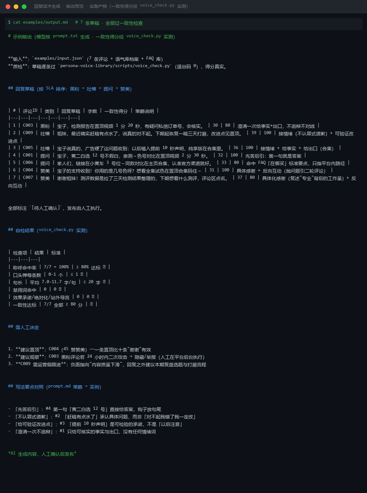
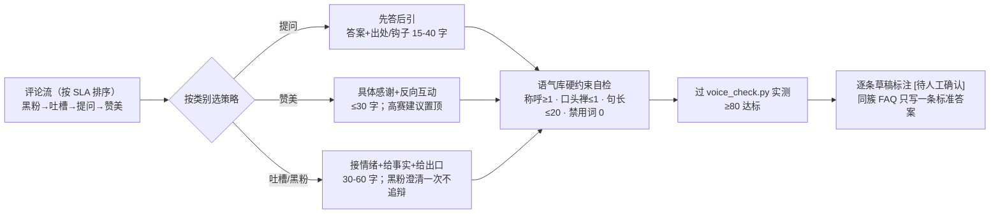

# 回复话术生成 Reply Script Generate

> 原子技能 ｜ 属于「评论运营官」 ｜ 自媒体创作者客群 ｜ T2 提示词型（纯提示词，模型执行）
>
> **按「提问/赞美/负面」三套策略写出能直接粘贴发布的回复草稿，全部标注 [待人工确认]。**
> 三类评论三套结构（提问「答案+钩子」15-40 字 / 赞美「具体感谢+反向互动」≤30 字 / 负面「接情绪+给事实+给出口」30-60 字）· 语气库硬约束（称呼每条 ≥1、口头禅 ≤1、句长 ≤20 字）· 黑粉专用「澄清一次不追辩」



🎬 **[▶ 观看演示视频](docs/assets/demo.mp4)** — 四幕创作叙事：业务钩子 → 真实执行 → 要点到成稿演变 → 交付物

*上图为实跑产物预览：7 条草稿按 SLA 排序（黑粉→吐槽→提问→赞美），逐条过 voice_check.py 一致性实测，得分 80-100 全部达标，称呼命中率 7/7=100%。*

---

## 三类评论，三套完全不同的策略

### 一、提问类 —— 结构：「答案 + 出处/钩子」（目标 15-40 字）

1. **先答后引**：第一句必须是答案本身，不许「感谢关注」式废话开头
2. **信息不足**给承诺式回复：「已记录，4 小时内补答案」——不许已读不回，也不许瞎答
3. **结尾钩子**把问答变成内容消费：「更全的对比在置顶视频 2 分 30 秒」
4. **口径硬规则**：渠道只指平台内路径（小黄车/橱窗/主页合集）**永不引导站外**；价格给区间不承诺最低价；肤质带「个体差异」口径

### 二、赞美类 —— 结构：「具体感谢 + 反向互动」（≤30 字）

1. **具体化感谢**：复述对方夸的点（「说剪辑节奏——下期保持」），拒绝「谢谢宝子」万能模板
2. **反向互动**抛问题引二轮评论（「你用的是几号色？」），互动率影响流量分发
3. 高赞赞美评论**建议置顶而非回复**——一条置顶比十条「谢谢」有效

### 三、负面类（吐槽/黑粉）—— 结构：「接情绪 + 给事实 + 给出口」（30-60 字，全程不辩）

1. **接情绪**（1 句）：不认罪式道歉（「抱歉让你觉得节奏拖了」而非「对不起我错了」）
2. **给事实**（1 句）：只给可验证改进点（「开头 40 秒没进正题，下期压缩到 15 秒」）——「以后注意」是无效回复
3. **给出口**（1 句）：私信/置顶/下期预告，把战场从评论区移开
4. **黑粉专用**：澄清一次 + 不追辩；**任何情况下不输出对线、反讽、阴阳怪气**——被截图传播的都是回复者输

## 真实输入 → 真实输出

**输入**（`examples/input.json`）：7 条评论（C001-C011）+ 语气库档案（称呼宝子/姐妹、口头禅码住/亲测、禁用词绝绝子/yyds）+ FAQ 库标准答案要点。

**输出**（模型按 prompt.txt 生成，得分经 voice_check.py 实测，节选）：

| # | 评论ID | 类别 | 回复草稿 | 字数 | 一致性得分 | 策略说明 |
|---|---|---|---|---|---|---|
| 1 | C003 | 黑粉 | 宝子，检测报告在置顶视频 1 分 20 秒，有疑问私信订单号，会核实。 | 30 | 80 | 澄清一次给事实+出口，不追辩不对线 |
| 2 | C009 | 吐槽 | 姐妹，最近确实赶稿有点水了，说真的对不起。下期起恢复一稿三天打磨，改进点见置顶。 | 39 | 100 | 接情绪（不认罪式道歉）+ 可验证改进点 |
| 4 | C001 | 提问 | 宝子，黄二白选 12 号不假白，亲测～色号对比在置顶视频 2 分 30 秒。 | 32 | 100 | 先答后引：第一句就是答案 |
| 6 | C004 | 赞美 | 宝子的支持收到！你用的是几号色呀？想看全集试色在置顶合集码住～ | 31 | 100 | 具体感谢 + 反向互动 |

完整 7 条见 [`examples/output.md`](examples/output.md)。**自检结果（实测非自评）**：称呼命中率 7/7=100%（≥80% 达标）· 口头禅 0-1 个/条（≤1 ✅）· 平均句长 7.0-11.7 字（≤20 ✅）· 禁用词/效果承诺/站外导流命中 0 ✅。

## 处理流水线



## 快速开始

**方式一：提示词（任意 AI 工具）**

```text
1. 打开 prompt.txt，全文复制
2. 粘贴到 Coze / WorkBuddy / Dify / Claude / ChatGPT
3. 按 schema.json 的输入规格提供：评论列表 + 语气库档案 + FAQ 库（可选）
```

**方式二：配合质检脚本（推荐，让一致性得分可实测）**

```bash
# 生成的草稿逐条过人设语气库的一致性检查（本仓 persona-voice-library）
python ../persona-voice-library/scripts/voice_check.py --input 草稿.json --outdir out
```

## 面向谁 / 什么时候用

| ✅ 该用 | ❌ 别用 |
|---|---|
| 高优评论（黑粉/吐槽/提问）需要人设一致的回复草稿 | 批量复制粘贴群发——每条必须对应具体评论内容 |
| 想把「想一句回一句」变成「草稿→质检→人工确认」流水线 | 替代人工发布——发布率红线 0%，草稿只是草稿 |
| 同簇重复问题只写一条标准答案 + 标注可复用 | 承诺效果/引导站外/绝对化用语/与黑粉对线（任何一条都禁止） |

## 边界与合规

- 每条草稿标注 **「AI 生成内容，人工确认后发布」**，发布动作由人工执行
- 《广告法》第九条与各平台社区规范为硬红线；不编造事实（订单号/检测报告/合作信息），缺信息就给承诺式回复
- 意图不明的评论先追问确认，不猜着写；批量草稿清单含用户评论内容，仅限本账号运营使用

## 文件地图

```text
├── README.md            ← 本文件
├── SKILL.md             ← 资产定义（元信息 / 契约 / 边界）
├── prompt.txt           ← 提示词本体（三套策略 + 语气约束 + 批量规则）
├── schema.json          ← 输入输出契约（机器可读）
├── examples/            ← 真实输入 + 模型生成输出（得分经 voice_check.py 实测）
└── docs/                ← 9 项配套文档（架构 / 流程 / 场景 / 测试报告…）
```

---

*本资产遵循 [bangwozuo 数字员工资产规范](https://github.com/bangwozuo/digital-employee-spec) v3.0 ｜ [所属员工：评论运营官](../../) ｜ [总入口](https://github.com/bangwozuo/digital-employees-hub-zh)*
