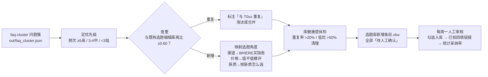

# 选题知识库 Topic Knowledge Base

> 原子技能 ｜ 属于「评论运营官」 ｜ 自媒体创作者客群 ｜ T4 连接器型（结构化知识库 + 本地文件读写）
>
> **把评论区提问变成可开拍的选题条目——评论区的提问是最免费且最精准的选题来源。**
> 条目 7 必填字段（来源簇/频次/优先级/选题建议/查重结果…）· 优先级量化（频次 ≥5 高 / 3-4 中 / <3 低）· 查重阈值 0.60（重复条目直接淘汰）· 库健康双指标（重复率 >20% 或低优占比 >50% 触发清理）


*上图为实跑产物预览（经 faq-to-topic-flow 实跑生成）：13 个问题簇 → 10 条候选选题，查重后新增 9、与既有库重复 1（T009 建议淘汰），全部「待人工确认」。*

---

## 入库标准（字段不全不许进库）

| 字段 | 必填 | 说明 |
|---|---|---|
| 选题ID | ✅ | T001 起连续编号 |
| 来源问题簇 | ✅ | FAQ 簇代表问题，追溯可查（哪条评论、哪个周期） |
| 提问频次 | ✅ | 来自 faq-cluster 实跑数据，**不许估** |
| 优先级 | ✅ | 频次 ≥5 高 / 3-4 中 / <3 低 |
| 选题建议 | ✅ | 「WHERE 买指南」「平替实验室」这类**可开拍的角度**，不是名词 |
| 状态 | ✅ | 候选 / 待人工确认 / 已入库 / 已拍 / 淘汰 |
| 查重结果 | ✅ | 与库内既有条目的相似度结论 |

**五条入库硬规则**：① 查重先行（编辑距离比 ≥0.60 判重复——「选题库里躺着 30 条重复的平替合集」是库死亡第一信号）② 频次即热度，低优条目 >库容量 50% 即为问题垃圾桶 ③ AI 产出全部「待人工确认」④ 闭环记录：拍完改「已拍」并回填链接，才能统计选题采纳率 ⑤ 带时效的选题必须标过期时间。

## 真实输入 → 真实输出

**输入**（`examples/input.json`）：上游 faq-cluster 聚类结果（23 条提问 → 13 簇）+ 既有选题库 `["新手化妆顺序教程", "平价粉底液合集"]`。

**输出**（实跑生成，候选条目节选）：

| 选题ID | 来源问题簇 | 频次 | 优先级 | 选题建议 | 查重结果 | 状态 |
|---|---|---|---|---|---|---|
| T001 | 求链接 | 3 | 中 | 「WHERE 买指南」：全渠道购买攻略 + 防坑清单 | 新增 | 待人工确认 |
| T003 | 多少钱 | 3 | 中 | 「值不值」横评：同价位 3 款对比 + 适合人群 | 新增 | 待人工确认 |
| T007 | 有没有平替 | 2 | 低 | 「平替实验室」：大牌 vs 平替盲测对比 | 新增 | 待人工确认 |
| T009 | 求新手教程 | 1 | 低 | 同 T008 | **与既有选题「新手化妆顺序教程」重复** | 建议淘汰 |

完整 10 条见 [`examples/output.md`](examples/output.md)。**库健康度（本期实跑）**：重复率 10%（正常，阈值 >20% 清理）；低优先级占比 70%（**触发** >50% 阈值——问题过散，建议先做置顶 Q&A 汇总沉淀频次）。人工确认建议：T001+T002 合并为「WHERE 买指南」，频次合计 6 → 升高优先级。

## 处理流水线



## 快速开始

**方式一：提示词（任意 AI 工具）**

```text
1. 打开 prompt.txt，全文复制
2. 粘贴到 Coze / WorkBuddy / Dify / Claude / ChatGPT
3. 按 schema.json 的输入规格提供：faq-cluster 问题簇 + 既有选题库清单
```

**方式二：工作流自动衔接（推荐）**

```bash
# 由高频问题转选题工作流端到端驱动（聚类 → 查重 → 条目生成）
python ../../workflows/faq-to-topic-flow/scripts/run_flow.py --demo
```

## 数据从哪来（连接器，只读）

| 数据源 | 方式 | 降级路径 |
|---|---|---|
| 评论区导出 | 平台后台导出 CSV/Excel（人工粘贴或上传） | 平台不给导出时手动复制高频评论 |
| faq-cluster 结果 | 上游 JSON（out/faq_cluster.json） | 无脚本环境时把问题列表直接粘贴给模型聚类 |
| 历史选题库 | 本地 Excel/CSV 维护 | 没有库时先用本次对话新建 |

连接器只读，不自动写平台；写入动作只有「本地库文件更新」且在人工确认后执行。

## 面向谁 / 什么时候用

| ✅ 该用 | ❌ 别用 |
|---|---|
| 「下次不知道拍什么」时打开库就有答案（带需求数据） | 混入创作者自嗨选题——本库只收「来自评论区提问」的选题 |
| 每周一审核候选 + 每月 1 号库体检（SOP 内置） | 编造提问频次——条目频次必须可追溯到实跑结果 |
| 选题采纳率与播放表现统计（评估链路 ROI） | 写「做一期视频」式废话建议——必须给可开拍的角度与结构 |

## 边界与合规

- 本资产输出为 **AI 生成内容**，仅内部使用不对外发布；入库/淘汰动作全部人工确认
- 条目里不存用户昵称（存簇 ID 即可追溯），用户评论数据仅用于频次统计
- 选题涉及的品类宣称（功效/价格）在拍摄脚本阶段另行过合规审查

## 文件地图

```text
├── README.md            ← 本文件
├── SKILL.md             ← 资产定义（元信息 / 契约 / 边界）
├── prompt.txt           ← 提示词本体（入库标准 + 五条硬规则 + 维护 SOP）
├── schema.json          ← 输入输出契约（机器可读）
├── examples/            ← 真实输入 + 实跑输出（经 faq-to-topic-flow 生成）
└── docs/                ← 9 项配套文档（架构 / 流程 / 场景 / 测试报告…）
```

---

*本资产遵循 [bangwozuo 数字员工资产规范](https://github.com/bangwozuo/digital-employee-spec) v3.0 ｜ [所属员工：评论运营官](../../) ｜ [总入口](https://github.com/bangwozuo/digital-employees-hub-zh)*
