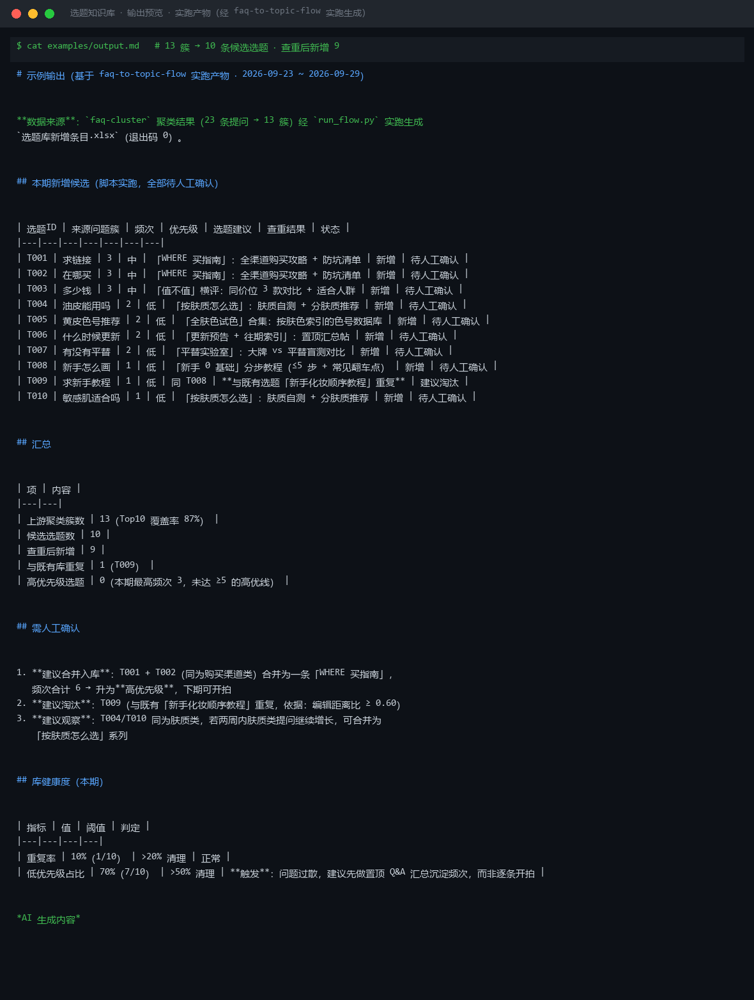

# 截图与录屏

> 以下素材均来自**真实执行**：`--run` 实拍终端 / 实跑产物文件，无摆拍。

## 演示视频


*Hyperframes 动态渲染 11s：命令逐字敲入（光标闪烁）→ 21 行真实输出逐行流式 → 完成态保持*

## 执行截图




---

## 附录：实跑输出明细

> 本资产为纯提示词客户端资产，无界面可截图。以下为**实跑运行效果**。

## 运行效果

### 输入

```json
{
  "system": "企业微信",
  "task": "读取客户列表并发送通知"
}

```

### 输出

## 字段映射

| 业务字段 | 企业微信字段 | 方向 | 说明 |
|---|---|---|---|
| 客户列表 | 客户联系 -> 客户列表 API（/cgi-bin/externalcontact/list） | 读取 | 需具备客户联系权限的企微应用 |
| 客户昵称 | external_userid 映射后的 name | 读取 | 通过 follower_userid 关联内部员工 |
| 通知内容 | 消息推送 API（/cgi-bin/message/send） | 写入 | 支持文本/图文/卡片等多种消息类型 |
| 接收对象 | touser / toparty / tagid | 写入 | 需明确指定员工或部门范围 |

## 操作清单

1. **读取阶段**：调用企业微信「获取客户列表」接口，传入 access_token 与 userid，分页获取外部联系人 ID 列表。
2. **转换阶段**：将 external_userid 批量映射为可读客户信息（昵称、标签、添加时间），存入中间表。
3. **编辑阶段**：按业务规则筛选目标客群，编辑通知文案（注意字数限制与合规要求）。
4. **发送阶段**：调用「发送应用消息」接口，选择消息类型（text/news/markdown），指定接收范围，执行推送。
5. **回写阶段**：记录发送状态、失败重试、到达率统计至本地数据库。

## 能力边界

> **本资产为纯提示词形态，不能真实读写外部系统。** 上述字段映射与操作清单仅为参考模板，实际执行需用户在企业微信管理后台配置自建应用、获取 corpid 与 secret、并在具备网络访问权限的服务器上完成 API 调用。

*AI 生成内容*


---

*运行效果由实跑验证生成*
