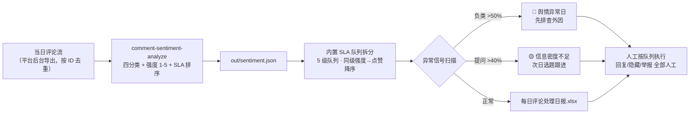

# 每日评论聚合分类 Daily Comment Aggregate Flow

> 工作流（T3 编排型）｜ 属于「评论运营官」 ｜ 自媒体创作者客群 ｜ 触发：定时，每日 21:00
>
> **把当天全部评论压成一张按 SLA 排好序的处理队列——打开日报就知道先回哪条，而不是从上往下漫无目的刷评论。**
> 2 步编排（四分类 + SLA 队列拆分）· 5 级 SLA 队列（黑粉 30 分钟 → 闲聊可不回）· 双异常信号（负类占比 >50% 舆情异常日 / 提问占比 >40% 信息密度不足）· 人工介入前 ≤5 分钟，评论处理 1-2h → 约 20 分钟


🎬 **[▶ 观看演示视频（在线播放）](https://cdn.jsdelivr.net/gh/bangwozuo/engagement-ops-zh@main/workflows/daily-comment-aggregate-flow/docs/assets/demo.mp4) · [GitHub 页](https://github.com/bangwozuo/engagement-ops-zh/blob/main/workflows/daily-comment-aggregate-flow/docs/assets/demo.mp4)** — 四幕数据叙事：业务钩子 → 真实执行 → 指标条形图生长 → 交付物

*上图来自真实执行：12 条评论 → 日报完成，需 2 小时内处理 5 条（黑粉 2 / 吐槽 3），产物落盘每日评论处理日报.xlsx + sentiment.json，发布率红线 0%。*

---

## 它编排什么（每步真实技能，DAG 与 SKILL.md 一致）

| 步骤 | 技能/环节 | 处理 | 输出 |
|---|---|---|---|
| 1 | `comment-sentiment-analyze`（scripts/sentiment_scan.py） | 词表+表情权重四分类（提问/赞美/吐槽/黑粉/闲聊兜底）+ 强度 1-5 打分 | out/sentiment.json + 评论分类处理清单.xlsx |
| 2 | （内置汇总）SLA 队列拆分 | 按「黑粉 30 分钟 > 吐槽 2 小时 > 提问 4 小时 > 赞美点赞 > 闲聊可不回」拆 5 个队列；同级按强度→点赞降序 | 每日评论处理日报.xlsx 的「SLA队列总览」sheet |
| 3 | 人工执行（流程终点，AI 不越界） | 运营者按队列顺序处理；黑粉回复走 reply-script-advice-flow，提问类次日进 faq-to-topic-flow | 处理完成标记（人工维护） |

**失败处理不静默**：上游脚本退出码 ≠0 → 中止并打印 stderr；sentiment.json 缺失/损坏 → 提示重跑步骤 1；评论数为 0 → 输出「今日无评论」占位日报正常退出。

### 量化异常信号（判定不看感觉）

- **负类合计占比 > 50%**：当天属「舆情异常日」，先排查爆款负面外因（被大 V 转发、差评扩散）再做日常队列
- **提问占比 > 40%**：内容信息密度不足（评论区在替内容补信息），次日选题参考 faq-to-topic-flow 结果

## 真实输入 → 真实输出

**输入**（`examples/input.json`，当日评论流，与情感分析技能同规格）：

```json
{
  "account": "@小鹿的好物日记",
  "platform": "抖音",
  "date": "2026-09-29",
  "comments": [
    {"id": "C003", "user": "黑粉本粉", "text": "就是骗子！收钱恰烂饭，大家都别买，我去举报了😡", "likes": 1},
    {"id": "C009", "user": "失望集合体", "text": "最近内容真的退步了，不如以前用心，很失望😭", "likes": 15}
  ]
}
```

**输出**（实跑，日报 SLA 队列总览节选）：

| 队列 | 条数 | 内容 |
|---|---|---|
| 🔴 30 分钟内 | 2 | 黑粉：回复澄清，视情节隐藏/举报，禁止对线 |
| 🟠 2 小时内 | 3 | 吐槽：致歉 + 改进点，可私信跟进 |
| 🟡 4 小时内 | 3 | 提问：给准确答案或站内指引 |
| 🟢 点赞即可 | 3 | 赞美：点赞 + 高赞置顶 |
| ⚪ 可不回 | 1 | 闲聊：每 2 小时集中扫一遍 |

完整日报见 [`examples/output.md`](examples/output.md)；产物：


- `out/每日评论处理日报.xlsx`（SLA 队列总览 + 处理队列黑粉标红 + 汇总）
- `out/sentiment.json` + `out/daily_flow_result.json`（机器可读执行结果）

## 处理流水线（DAG）



## 快速开始

**方式一：提示词（任意 AI 工具）**

```text
1. 打开 prompt.txt，全文复制
2. 粘贴到 Coze / WorkBuddy / Dify / Claude / ChatGPT
3. 按 schema.json 的输入规格提供：当日评论流（21:00 跑 00:00-21:00 的评论）
```

**方式二：脚本（端到端编排，推荐）**

```bash
# 演示模式（内置 12 条真实样例）
python scripts/run_flow.py --demo
# 指定输入
python scripts/run_flow.py --input examples/input.json --outdir out
```

编排规则：技能资产必须真实存在（skills/comment-sentiment-analyze/）；步骤间经 JSON 文件衔接，不在提示词里传大段原文；全流程无模型调用依赖。

## 面向谁 / 什么时候用

| ✅ 该用 | ❌ 别用 |
|---|---|
| 每天 21:00 定时跑，发布高峰后 1-2 小时评论量最全 | 把两天评论混在一个文件里（21:00 后的进明天日报） |
| 评论量达到人工瓶颈（1-2h → 20min，月省约 30h） | 自动执行回复/隐藏/举报——流程不持有任何平台写权限 |
| 执行前扫一眼存疑项清单（反讽/老粉玩笑由模型复核） | 同一天跑两次不按评论 ID 去重——评论会重复计数 |

## 边界与合规

- 日报标注 **「AI 生成内容」**，仅内部使用不外发
- 用户昵称与评论内容不出本账号运营范围；所有对外动作（回复/隐藏/举报）人工执行
- 日报必须记录「输入条数」，对照平台显示的评论总数核对——平台导出截断会漏爆款日的评论

## 文件地图

```text
├── README.md               ← 本文件
├── SKILL.md                ← 工作流定义（DAG / 契约 / 边界）
├── prompt.txt              ← 编排提示词（步骤明细 + 异常信号 + 失败模式）
├── schema.json             ← 输入输出契约（机器可读）
├── scripts/run_flow.py     ← 端到端编排脚本（调上游技能 → 拆队列 → 出日报）
├── examples/               ← 真实输入 + 实跑输出
├── docs/                   ← 9 项配套文档（架构 / 流程 / 场景 / 测试报告…）
└── out/                    ← 实跑产物（每日评论处理日报.xlsx / sentiment.json 等）
```

---

*本资产遵循 [bangwozuo 数字员工资产规范](https://github.com/bangwozuo/digital-employee-spec) v3.0 ｜ [所属员工：评论运营官](../../) ｜ [总入口](https://github.com/bangwozuo/digital-employees-hub-zh)*
