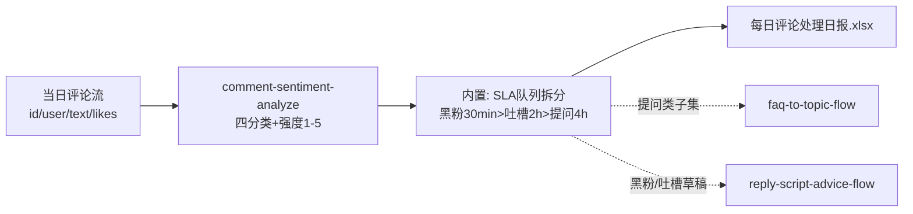

# 每日评论聚合分类

每日 21:00 把当天评论压成一张**按 SLA 排好序的处理队列**：打开日报就知道先回哪条、
每类花几分钟。评论处理 1-2 小时 → 约 20 分钟，月省约 30 小时。

## 元信息

| 字段 | 值 |
|------|-----|
| ID | `de_media_03_wf01` |
| 类型 | **`composite`（复合技能/工作流）** |
| 所属员工 | 评论运营官 |
| 阶段 | `P0` |
| 复杂度 | `M` |
| 触发方式 | 定时（每日 21:00，发布高峰后评论量最全时点） |
| ROI | 评论处理 1-2h → 20min，月省约 30h×¥30≈¥900 vs ¥30-60 |
| 资产形态 | 可跑编排脚本 + 深度流程提示词（无模型调用依赖、无 API Key） |

## 编排的原子技能

| # | 原子技能 | 能力 |
|---|---------|------|
| 1 | [评论情感分析](../../skills/comment-sentiment-analyze/) | 四分类+强度打分+SLA 排序（scripts/sentiment_scan.py） |

## 步骤链路（DAG）



## 步骤明细

| # | 步骤 | 技能资产 | 输入 | 输出 | 失败处理 |
|---|------|---------|------|------|---------|
| 1 | 评论四分类+强度打分 | `comment-sentiment-analyze` | 当日评论流（平台导出/人工粘贴） | `out/sentiment.json` + 分类清单.xlsx | 脚本退出码≠0 中止并打印 stderr；空评论进存疑项不猜分类 |
| 2 | SLA 队列拆分（内置） | 本流程 | `out/sentiment.json` | 日报.xlsx「SLA队列总览」 | JSON 缺失/损坏 → 中止提示重跑；0 评论 → 占位日报正常退出 |
| 3 | 人工执行队列 | （人工） | 日报处理队列 | 处理完成标记 | 草稿缺失 → 工单标「待生成」；黑粉二次攻击 → 人工隐藏/举报，AI 不越界 |

## 输入规格

| 字段 | 类型 | 必填 | 说明 |
|------|------|------|------|
| `comments` | array | ✅ | 当日评论（id/user/text/likes）；21:00 跑 00:00-21:00 窗口 |
| `account` / `platform` / `date` | string | ⬜ | 写入日报汇总 |

## 输出规格

| 字段 | 类型 | 说明 |
|------|------|------|
| `summary` | object | 评论总数 / 四分类计数 / 负类合计占比 / 需 2 小时内处理条数 |
| `steps` | array | 各步骤执行状态与产物路径 |
| `deliverable` | file | `out/每日评论处理日报.xlsx`（SLA队列总览 + 处理队列 + 汇总） |

## 错误处理

| 情况 | 处理方式 |
|------|---------|
| 上游脚本退出码 ≠0 | 流程中止，打印 stderr（不静默失败），修复后重跑 |
| 产物 JSON 缺失/损坏 | 中止并提示重跑上游步骤 |
| 评论导出截断 | 日报记录「输入条数」，与平台显示总数核对，缺则分批导 |
| 重复导入 | 按评论 ID 去重后再跑 |
| 负类合计占比 >50% | 标注「舆情异常日」，先查外因（大 V 转发/差评扩散）再做日常队列 |

## 使用步骤

### 方式一：跑脚本（端到端，产出真实日报）

```bash
python3 <FLOW_DIR>/scripts/run_flow.py --input input.json --outdir out
python3 <FLOW_DIR>/scripts/run_flow.py --demo      # 无输入看效果
```

### 方式二：手动编排（任意 AI 平台）

1. 把 `comment-sentiment-analyze` 的 prompt.txt 作为系统提示词，输入当日评论 → 得分类结果
2. 按 SLA 规则手工排序成队列（或直接用脚本产物）
3. 按队列处理；黑粉/吐槽回复走 reply-script-advice-flow，提问次日走 faq-to-topic-flow

## 验收标准

- [x] 每步技能资产齐全且真实存在
- [x] 步骤间以 JSON 文件衔接，字段可衔接（sentiment.json items → 处理队列）
- [x] 末步产物带 AI 生成标识
- [x] 全流程人工确认环节（对外动作由人工执行）

## 边界（不做的事）

- ❌ 不自动执行回复/隐藏/举报——流程只产出队列与建议
- ❌ 不跨天混合评论（21:00 后进明天日报）；不重复计数（按 ID 去重）
- ❌ 不在提示词里传大段原文——步骤间走 JSON 文件
- ❌ 不猜缺失数据：导出截断如实标注

## 调用示例

**输入**（`examples/input.json`，节选）：

```json
{
  "account": "@小鹿的好物日记",
  "platform": "抖音",
  "date": "2026-09-29",
  "comments": [
    {"id": "C001", "user": "奶盖不加糖", "text": "姐这个粉底液色号是多少呀？黄二白能用吗", "likes": 12},
    {"id": "C003", "user": "黑粉本粉", "text": "就是骗子！收钱恰烂饭，大家都别买，我去举报了😡", "likes": 1}
  ]
}
```

**输出**（run_flow.py 实跑，退出码 0）：`out/每日评论处理日报.xlsx`——
12 条评论：黑粉 2（30 分钟内）/ 吐槽 3（2 小时内）/ 提问 3 / 赞美 3 / 闲聊 1，
需 2 小时内处理 5 条。详见 examples/output.md。

## 所属工作流

本资产为复合技能（工作流），是独立的端到端流程；下游衔接
`faq-to-topic-flow`（提问类）与 `reply-script-advice-flow`（黑粉/吐槽草稿）。

## 合规声明

- 本流程产出为 **AI 辅助队列**，所有对外动作由人工执行并按平台要求标注 AI 生成内容
- 用户数据仅限本账号运营使用，日报不外发
- 流程不持有任何平台写权限

---

*本技能遵循 [bangwozuo 数字员工资产规范](https://github.com/bangwozuo/digital-employee-spec) v3.0*
