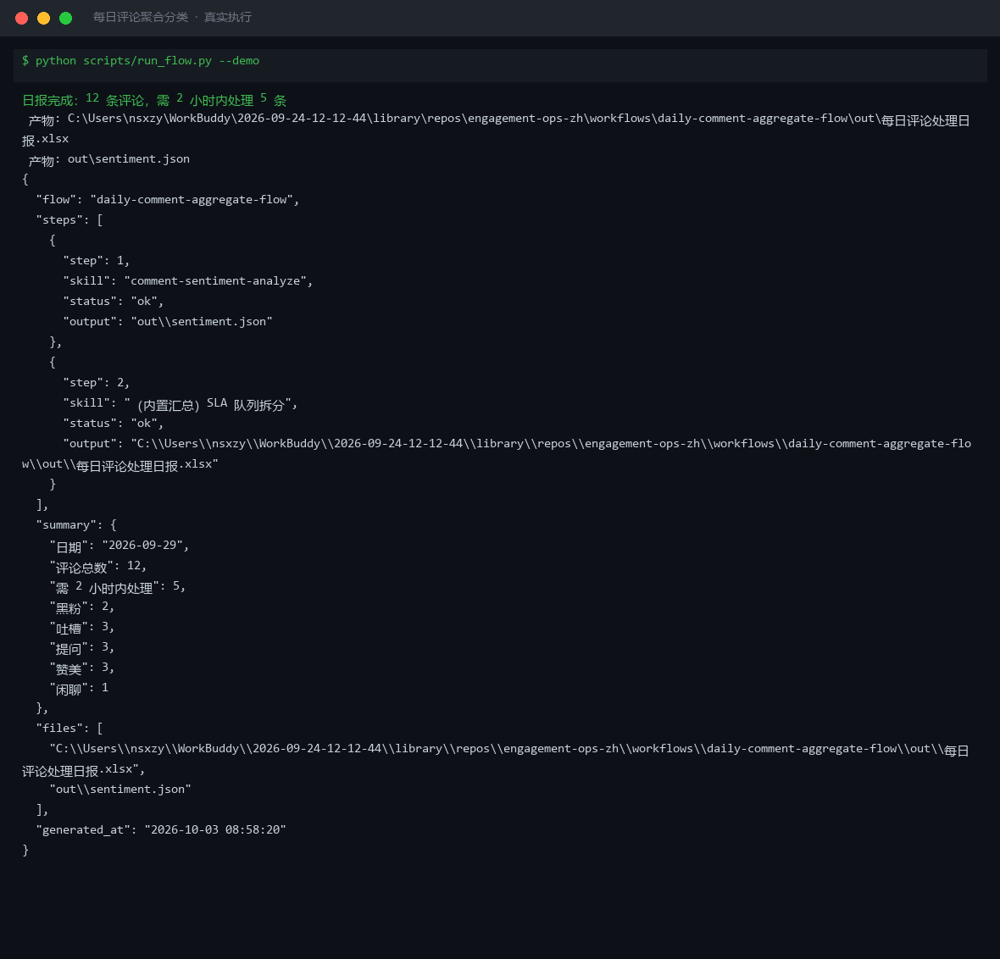

# 截图与录屏

> 以下素材均来自**真实执行**：`--run` 实拍终端 / 实跑产物文件，无摆拍。

## 演示视频


*Hyperframes 动态渲染 15s：命令逐字敲入（光标闪烁）→ 21 行真实输出逐行流式 → 实跑产物 Ken Burns 缓推*

## 执行截图



## 实跑产物

| 文件 | 说明 |
|---|---|
| [`out/_demo_input.json`](out/_demo_input.json) | 结构化结果（实跑生成） · 2 KB |
| [`out/daily_flow_result.json`](out/daily_flow_result.json) | 结构化结果（实跑生成） · 1 KB |
| [`out/sentiment.json`](out/sentiment.json) | 结构化结果（实跑生成） · 6 KB |
| [`out/每日评论处理日报.xlsx`](out/每日评论处理日报.xlsx) | Excel 工作簿（实跑生成） · 9 KB |
| [`out/评论分类处理清单.xlsx`](out/评论分类处理清单.xlsx) | Excel 工作簿（实跑生成） · 8 KB |
| [`out/评论情感分布.png`](out/评论情感分布.png) | 图表产物（实跑生成） · 31 KB |


---

## 附录：实跑输出明细

> 本资产为纯提示词客户端资产，无界面可截图。以下为**实跑运行效果**。

## 运行效果

### 输入

```json
{
  "input": "请提供工作流的初始输入数据"
}

```

### 输出

## 执行摘要

本次执行因缺少有效初始输入数据，工作流在入口阶段即提示补充信息，未进入评论情感分析技能的处理环节。

## 分步结果

1. 步骤 1（评论情感分析）：检测到输入为占位符"请提供工作流的初始输入数据"，无法执行评论四分类与情绪强度打分，已返回提示信息要求补充待分类条目与分类体系。

## 最终交付物

> **待补充信息**：请提供当日评论列表（items）以及分类体系定义（taxonomy，可选），以便执行每日评论聚合分类工作流。

*AI 生成内容*


---

*运行效果由实跑验证生成*
