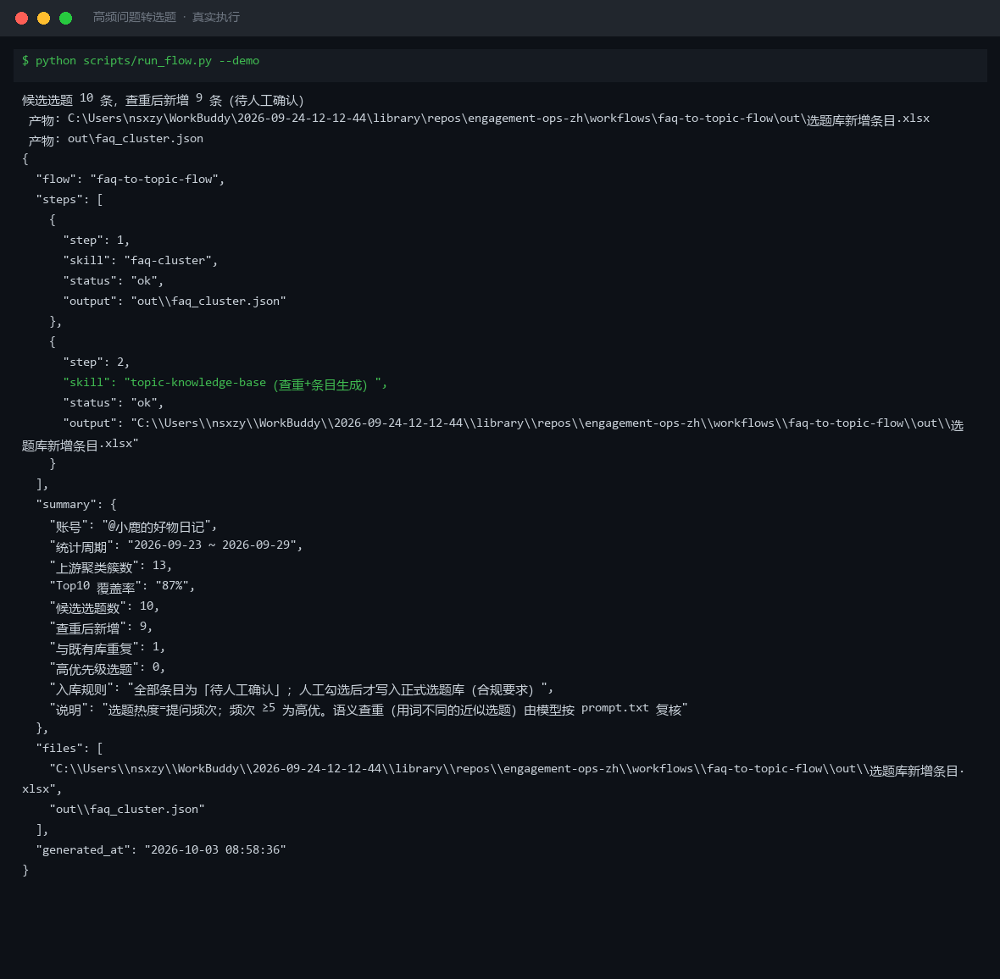
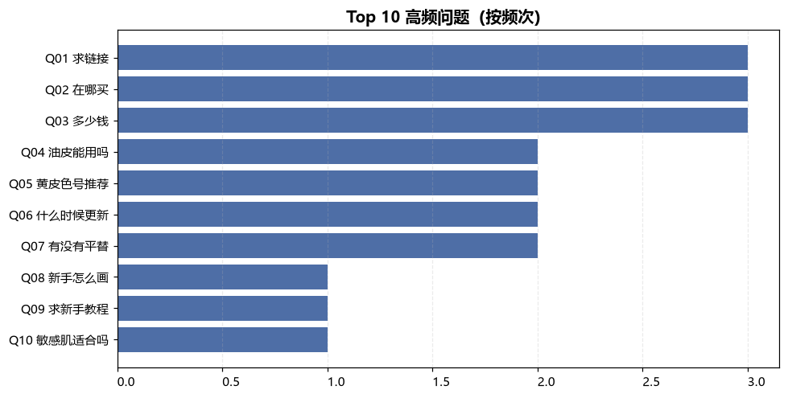
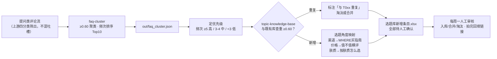

# 高频问题转选题 FAQ to Topic Flow

> 工作流（T3 编排型）｜ 属于「评论运营官」 ｜ 自媒体创作者客群 ｜ 触发：事件（每日评论聚合流程跑完后自动衔接）
>
> **把提问类评论变成可开拍的选题条目：聚类 → 排榜 → 查重 → 定优先级，每条选题自带「几个人问了、哪一周问的」需求数据。**
> 2 技能 DAG（faq-cluster → topic-knowledge-base）· 9 条选题角度映射（渠道→WHERE 买指南 / 价格→值不值横评 / 肤质→按肤质怎么选…）· 查重阈值 0.60 · 直接缓解第一痛点（选题枯竭）



🎬 **[▶ 观看演示视频（在线播放）](https://cdn.jsdelivr.net/gh/bangwozuo/engagement-ops-zh@main/workflows/faq-to-topic-flow/docs/assets/demo.mp4) · [GitHub 页](https://github.com/bangwozuo/engagement-ops-zh/blob/main/workflows/faq-to-topic-flow/docs/assets/demo.mp4)** — 四幕创作叙事：业务钩子 → 真实执行 → 要点到成稿演变 → 交付物

*上图来自真实执行：23 条提问 → 13 簇 → 候选选题 10 条，查重后新增 9 条（全部「待人工确认」），产物落盘选题库新增条目.xlsx + faq_cluster.json。*

---

## 它编排什么（DAG 节点 = 本仓真实技能 slug）

| 步骤 | 技能 | 处理 | 输出 |
|---|---|---|---|
| 1 | `faq-cluster`（scripts/faq_cluster.py） | 归一化 → 相似度（bigram Jaccard / 编辑距离比取 max）≥0.60 贪心聚类 → 频次降序 → Top 10 进 FAQ 库 | out/faq_cluster.json + 高频问题聚类.xlsx + faq_top10.png |
| 2 | `topic-knowledge-base`（查重+条目生成内置） | 逐 Top10 簇生成条目：优先级（频次 ≥5 高 / 3-4 中 / <3 低）→ 与既有库查重（编辑距离比 ≥0.60 判重复）→ 按簇关键词映射选题角度 | out/选题库新增条目.xlsx + topic_flow_result.json |
| 3 | 人工确认（流程终点） | 主理人每周一审核：勾选入库 / 合并同类 / 淘汰重复；拍完改「已拍」回填链接 | 正式选题库更新（人工执行） |

**失败处理不静默**：上游退出码 ≠0 或产物缺失 → 中止打印错误；提问为空 → 输出「本周无新增选题」正常退出；全部重复 → 标注「无新增，跳过入库」；**Top10 覆盖率 <60% → 正常继续但标注「问题过散」**。

## 真实输入 → 真实输出

**输入**（`examples/input.json`）：

```json
{
  "account": "@小鹿的好物日记",
  "period": "2026-09-23 ~ 2026-09-29",
  "existing_topics": ["新手化妆顺序教程", "平价粉底液合集"],
  "questions": ["在哪买", "在哪买啊", "姐妹在哪买", "求链接", "求个链接", "求链接！", "多少钱", "这个多少钱"]
}
```

**输出**（实跑，候选条目节选）：

| 选题ID | 来源问题簇 | 频次 | 优先级 | 选题建议 | 查重结果 | 状态 |
|---|---|---|---|---|---|---|
| T001 | 求链接 | 3 | 中 | 「WHERE 买指南」：全渠道购买攻略 + 防坑清单 | 新增 | 待人工确认 |
| T003 | 多少钱 | 3 | 中 | 「值不值」横评：同价位 3 款对比 + 适合人群 | 新增 | 待人工确认 |
| T007 | 有没有平替 | 2 | 低 | 「平替实验室」：大牌 vs 平替盲测对比 | 新增 | 待人工确认 |
| T009 | 求新手教程 | 1 | 低 | 同 T008 | **与既有选题「新手化妆顺序教程」重复** | 建议淘汰 |

完整 10 条见 [`examples/output.md`](examples/output.md)。**人工确认建议（实跑）**：T001+T002 同为渠道类合并后频次 6 → 升高优，下期可开拍；T009 重复淘汰；肤质类 T004/T010 观察两周再决定是否系列化。产物：



- `out/选题库新增条目.xlsx`（候选选题，重复行标红 + 汇总）
- `out/faq_cluster.json` + `out/topic_flow_result.json`（机器可读执行结果）

## 处理流水线（DAG）



## 快速开始

**方式一：提示词（任意 AI 工具）**

```text
1. 打开 prompt.txt，全文复制
2. 粘贴到 Coze / WorkBuddy / Dify / Claude / ChatGPT
3. 按 schema.json 的输入规格提供：提问列表 + 既有选题库清单
```

**方式二：脚本（端到端编排，推荐）**

```bash
# 演示模式（内置 23 条真实提问 + 既有库）
python scripts/run_flow.py --demo
# 指定输入
python scripts/run_flow.py --input examples/input.json --outdir out
```

编排规则：DAG 节点必须是真实技能 slug；步骤间经 JSON 衔接；模型只介入语义二次合并与选题建议润色；写库唯一路径是人工确认后的本地文件更新。

## 面向谁 / 什么时候用

| ✅ 该用 | ❌ 别用 |
|---|---|
| 评论区真实需求「烂在信息流里」之前接住它 | 上游混入吐槽——「有没有不这么水的版本」会变成假选题 |
| 每周选题会前跑一遍，候选带着频次数据上会 | 跨周期不查重——「在哪买」寒假问过暑假又问，该提示做续集 |
| 连续 2 周无高优选题 → 主动开新话题制造新问题 | 频次通胀期拍板——单条爆款制造的临时高频，跨周频次才可信 |

## 边界与合规

- 清单标注 **「AI 生成内容」**，仅内部使用；候选条目连续 2 周无人确认标红提醒，超 4 周自动降级
- 条目不存用户昵称（存簇 ID 追溯）；评论数据仅用于频次统计
- 选题涉及的品类宣称（功效/价格）在拍摄脚本阶段另行过合规审查；不自动写任何平台

## 文件地图

```text
├── README.md               ← 本文件
├── SKILL.md                ← 工作流定义（DAG / 契约 / 边界）
├── prompt.txt              ← 编排提示词（步骤明细 + 量化规则 + 失败模式）
├── schema.json             ← 输入输出契约（机器可读）
├── scripts/run_flow.py     ← 端到端编排脚本（调 faq-cluster → 查重 → 条目生成）
├── examples/               ← 真实输入 + 实跑输出
├── docs/                   ← 9 项配套文档（架构 / 流程 / 场景 / 测试报告…）
└── out/                    ← 实跑产物（选题库新增条目.xlsx / faq_cluster.json 等）
```

---

*本资产遵循 [bangwozuo 数字员工资产规范](https://github.com/bangwozuo/digital-employee-spec) v3.0 ｜ [所属员工：评论运营官](../../) ｜ [总入口](https://github.com/bangwozuo/digital-employees-hub-zh)*
