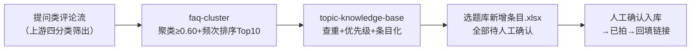

# 高频问题转选题

把提问类评论变成**可开拍的选题条目**：聚类 → 排榜 → 查重 → 定优先级。
每条选题都自带"几个人问了、哪一周问的"的需求数据——评论区选题免费且精准，
直接缓解选题枯竭。

## 元信息

| 字段 | 值 |
|------|-----|
| ID | `de_media_03_wf02` |
| 类型 | **`composite`（复合技能/工作流）** |
| 所属员工 | 评论运营官 |
| 阶段 | `P0` |
| 复杂度 | `M` |
| 触发方式 | 事件（daily-comment-aggregate-flow 完成后自动衔接） |
| ROI | 闭环核心：评论区选题免费且精准，直接缓解第一痛点（选题枯竭） |
| 资产形态 | 可跑编排脚本 + 深度流程提示词（无模型调用依赖、无 API Key） |

## 编排的原子技能

| # | 原子技能 | 能力 |
|---|---------|------|
| 1 | [高频问题聚类](../../skills/faq-cluster/) | 相似度聚类 + 频次排序 + Top10 FAQ 库（scripts/faq_cluster.py） |
| 2 | [选题知识库](../../skills/topic-knowledge-base/) | 查重 + 优先级 + 条目结构 + 入库确认规则 |

## 步骤链路（DAG）



## 步骤明细

| # | 步骤 | 技能资产 | 输入 | 输出 | 失败处理 |
|---|------|---------|------|------|---------|
| 1 | 提问聚类+高频问题榜 | `faq-cluster` | 提问类评论流 | `out/faq_cluster.json` + 聚类.xlsx | 退出码≠0 中止打印 stderr；无实义输入标「输入无效」不产虚假榜单；覆盖率<60% 标「问题过散」继续 |
| 2 | 查重+条目生成 | `topic-knowledge-base` | faq_cluster.json + existing_topics | `out/选题库新增条目.xlsx` | 上游产物缺失中止；全重复正常退出标「无新增」；既有库为空提示新库已建立 |
| 3 | 人工确认入库 | （人工） | 候选条目 | 已入库/已拍条目 | 语义近似重复由模型复核；候选积压 2 周标红、4 周自动降级 |

## 输入规格

| 字段 | 类型 | 必填 | 说明 |
|------|------|------|------|
| `questions` | array | ✅ | 提问类评论（上游四分类筛出；混入吐槽会污染选题） |
| `existing_topics` | array | ⬜ | 库内既有选题，用于查重；为空则新建库 |
| `account` / `period` | string | ⬜ | 账号与统计周期 |

## 输出规格

| 字段 | 类型 | 说明 |
|------|------|------|
| `summary` | object | 候选数 / 查重后新增 / 重复数 / 高优先级数 / 上游覆盖率 |
| `steps` | array | 各步骤执行状态与产物路径 |
| `deliverable` | file | `out/选题库新增条目.xlsx`（候选选题 + 汇总，重复行标红） |

## 错误处理

| 情况 | 处理方式 |
|------|---------|
| 上游 faq-cluster 退出码 ≠0 / 产物缺失 | 中止并打印 stderr，不静默失败 |
| 全部条目与库重复 | 正常退出，清单标注「无新增，跳过入库」 |
| 提问子集混入吐槽 | 回退上游补情感分类；汇总标注数据源风险 |
| 跨周重复问题 | 月度库体检兜底；库内「已拍」同题条目提示做续集/更新版 |
| 候选积压 | 2 周未确认标红，4 周自动降级（热度已过） |

## 使用步骤

### 方式一：跑脚本（端到端，产出真实条目清单）

```bash
python3 <FLOW_DIR>/scripts/run_flow.py --input input.json --outdir out
python3 <FLOW_DIR>/scripts/run_flow.py --demo
```

### 方式二：手动编排（任意 AI 平台）

1. 用 `faq-cluster` 的 prompt.txt 聚类提问列表 → 得高频问题榜
2. 用 `topic-knowledge-base` 的 prompt.txt 逐簇条目化（查重 + 优先级 + 选题建议）
3. 人工勾选入库；入库后状态「已拍」回填链接做季度 ROI 统计

## 验收标准

- [x] DAG 节点均为本仓真实技能 slug
- [x] 步骤间 JSON 衔接（faq_cluster.json → 条目化），字段可衔接
- [x] 末步产物带 AI 生成标识；全流程人工确认入库
- [x] 失败处理可演练（上游中止/产物缺失/全重复/空输入）

## 边界（不做的事）

- ❌ 不自动写入选题库——全部条目「待人工确认」
- ❌ 不收创作者自嗨选题（只收评论区提问型选题）
- ❌ 不编造频次——条目频次可追溯 faq-cluster 实跑结果
- ❌ 不给语义近似的重复选题放行（模型复核环节不可跳过）

## 调用示例

**输入**（`examples/input.json`，节选）：

```json
{
  "account": "@小鹿的好物日记",
  "period": "2026-09-23 ~ 2026-09-29",
  "existing_topics": ["新手化妆顺序教程", "平价粉底液合集"],
  "questions": ["在哪买", "在哪买啊", "姐妹在哪买", "求链接", "求个链接", "求链接！", "多少钱"]
}
```

**输出**（run_flow.py 实跑，退出码 0）：`out/选题库新增条目.xlsx`——
23 条提问 → 13 簇（Top10 覆盖率 87%）→ 10 条候选：9 新增 + 1 重复
（「求新手教程」与既有「新手化妆顺序教程」重复被拦截）。详见 examples/output.md。

## 所属工作流

本资产为复合技能（工作流），上游衔接 `daily-comment-aggregate-flow`（提问类子集），
产物交 `topic-knowledge-base` 的库维护 SOP（每周一人工审核）。

## 合规声明

- 本流程产出为 **AI 辅助候选清单**，入库/淘汰由人工确认，输出标注 AI 生成内容
- 选题涉及的品类宣称在拍摄脚本阶段另行过合规审查
- 条目不存用户昵称，评论数据仅用于频次统计

---

*本技能遵循 [bangwozuo 数字员工资产规范](https://github.com/bangwozuo/digital-employee-spec) v3.0*
