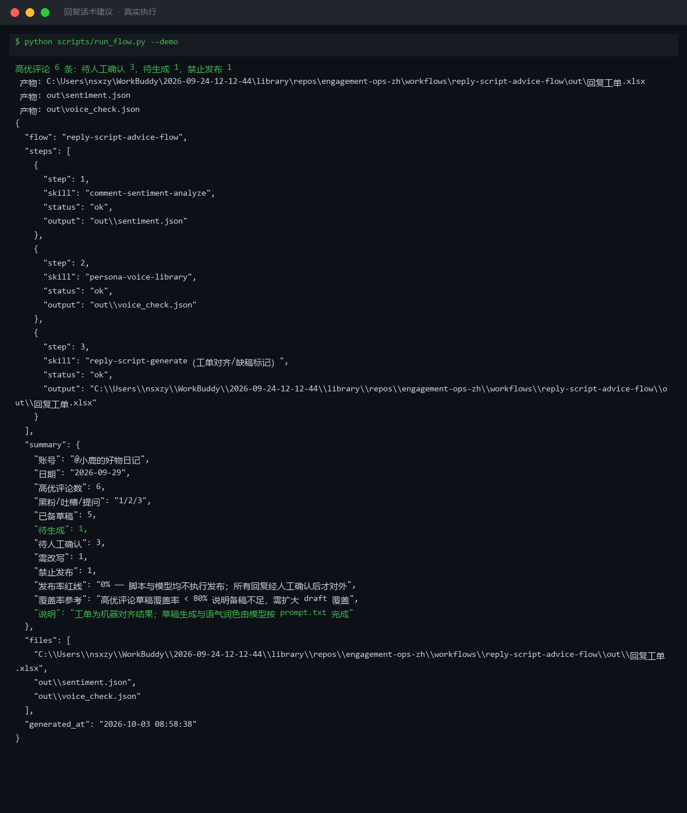
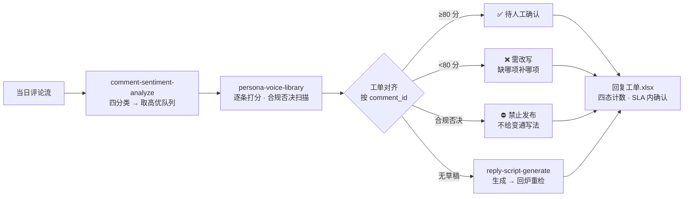

# 回复话术建议 Reply Script Advice Flow

> 工作流（T3 编排型）｜ 属于「评论运营官」 ｜ 自媒体创作者客群 ｜ 触发：人工 / 事件（每日评论聚合流程产出处理队列后）
>
> **给高优评论配齐「过人设一致性检查」的回复草稿，以四态工单交人工确认——发布率红线 0%，工单是终点。**
> 2 技能 DAG + 内置工单对齐（comment-sentiment-analyze + persona-voice-library → reply-script-generate 补稿）· 四态状态机（待人工确认/需改写/禁止发布/待生成）· 一致性达标线 80 分（40/20/20/20）· 草稿覆盖率 <80% 标「备稿不足」



🎬 **[▶ 观看演示视频](docs/assets/demo.mp4)** — 四幕数据叙事：业务钩子 → 真实执行 → 指标条形图生长 → 交付物

*上图来自真实执行：高优评论 6 条（黑粉 1/吐槽 2/提问 3）→ 待人工确认 3 / 需改写 1 / 禁止发布 1 / 待生成 1，草稿覆盖率 83%（≥80% 未触发备稿不足），产物落盘回复工单.xlsx + sentiment.json + voice_check.json。*

---

## 它编排什么（每步真实技能，DAG 与 SKILL.md 一致）

| 步骤 | 技能 | 处理 | 输出 |
|---|---|---|---|
| 1 | `comment-sentiment-analyze`（sentiment_scan.py） | 四分类 + SLA 排序 → 取高优队列（黑粉 30 分钟/吐槽 2 小时/提问 4 小时）；赞美与闲聊不进本流程 | out/sentiment.json |
| 2 | `persona-voice-library`（voice_check.py） | 逐条打分：称呼 40 + 口头禅 20 + 句长 20 + 零违禁 20，≥80 达标；效果承诺/绝对化/站外导流任一命中 → 合规否决 | out/voice_check.json |
| 3 | （内置汇合）工单对齐 | 按 comment_id 对齐生成四态状态机；高优评论无草稿 → 交 `reply-script-generate` 生成后回步骤 2 重检 | out/回复工单.xlsx（禁止发布行标红） |

### 四态状态机（本流程的核心交付：每条高优评论任何时刻都有明确去向）

| 状态 | 判定 | 下一步 |
|---|---|---|
| 待人工确认 | 有草稿且 ≥80 分 | 人工确认后发布（发布由人执行） |
| 需改写 | 有草稿但 <80 分 | 缺哪项补哪项后重检 |
| 禁止发布 | 合规否决命中 | 附违禁明细，**不给变通写法** |
| 待生成 | 高优评论无草稿 | 交模型生成 → 回步骤 2 重检 |

## 真实输入 → 真实输出

**输入**（`examples/input.json`）：当日评论流 + 语气库档案（voice）+ 5 条回复草稿（drafts）。

**输出**（实跑，回复工单节选）：

| 评论ID | 类别 | SLA | 评论摘要 | 一致性得分 | 工单状态 | 下一步 |
|---|---|---|---|---|---|---|
| C003 | 黑粉 | 30 分钟内 | 就是骗子！收钱恰烂饭…😡 | 20 | ⛔ 禁止发布 | 按违禁明细改写（100% 承诺/加微信导流）再重检 |
| C005 | 吐槽 | 2 小时内 | 广告太多了，划水的部分… | 40 | 需改写 | 补齐称呼/口头禅后重检 |
| C002 | 吐槽 | 2 小时内 | 讲得乱七八糟，三分钟还没… | 100 | 待人工确认 | 人工确认后发布 |
| C011 | 提问 | 4 小时内 | 油皮用了会闷痘吗？ | — | 待生成 | 交 reply-script-generate 生成 → 重检 |

完整工单见 [`examples/output.md`](examples/output.md)。**禁止发布明细（D3）**：「亲～本产品 100% 正品保证，加微信还有专属优惠哦！」= 效果承诺 + 站外导流 + 禁用词三连中；按 prompt.txt 约定不给「加V/＋薇」式变通——那是规避审核。产物：`out/回复工单.xlsx`（四态计数 + 禁止发布标红）+ `out/advice_flow_result.json`。

## 处理流水线（DAG）



## 快速开始

**方式一：提示词（任意 AI 工具）**

```text
1. 打开 prompt.txt，全文复制
2. 粘贴到 Coze / WorkBuddy / Dify / Claude / ChatGPT
3. 按 schema.json 的输入规格提供：评论流 + 语气库档案 + 回复草稿
```

**方式二：脚本（端到端编排，推荐）**

```bash
# 演示模式（内置评论 + 草稿 + 语气库）
python scripts/run_flow.py --demo
# 指定输入
python scripts/run_flow.py --input examples/input.json --outdir out
```

编排规则：DAG 节点 = 真实技能 slug；步骤间经 JSON 衔接；语气库字段缺失（无称呼词表）→ 中止并列缺失清单，不用默认词表硬检。

## 面向谁 / 什么时候用

| ✅ 该用 | ❌ 别用 |
|---|---|
| 把「想一句回一句」变成「草稿→质检→人工确认」可控流水线 | 替代人工确认——工单攒 3 天一起点确认 = 无人复核，SLA 超时进复盘 |
| 草稿覆盖率自检（<80% 先扩备稿再处理队列） | 为刷分堆砌口头禅——每条 ≤1 个，超出判「需改写」 |
| 黑粉工单 30 分钟内必须有人看过（继承上游 SLA） | 给禁止发布的草稿任何变通写法——属规避审核的违规协助 |

## 边界与合规

- 工单标注 **「AI 生成内容」**；**发布率红线 0%**，所有回复经人工确认后由人工发布
- 合规否决（效果承诺/绝对化/站外导流）不给任何变通写法；工单逐条显示评论摘要，人工确认时必须读一眼再放行
- 工单含用户评论内容，仅限本账号运营使用，不外发；语气库每月随平台规则校对一次

## 文件地图

```text
├── README.md               ← 本文件
├── SKILL.md                ← 工作流定义（DAG / 契约 / 边界）
├── prompt.txt              ← 编排提示词（步骤明细 + 四态状态机 + 失败模式）
├── schema.json             ← 输入输出契约（机器可读）
├── scripts/run_flow.py     ← 端到端编排脚本（高优过滤 → 打分 → 工单对齐）
├── examples/               ← 真实输入 + 实跑输出
├── docs/                   ← 9 项配套文档（架构 / 流程 / 场景 / 测试报告…）
└── out/                    ← 实跑产物（回复工单.xlsx / voice_check.json 等）
```

---

*本资产遵循 [bangwozuo 数字员工资产规范](https://github.com/bangwozuo/digital-employee-spec) v3.0 ｜ [所属员工：评论运营官](../../) ｜ [总入口](https://github.com/bangwozuo/digital-employees-hub-zh)*
