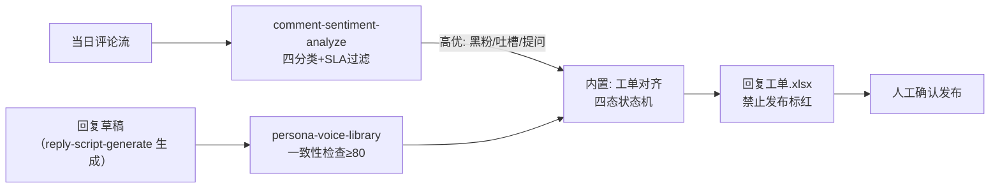

# 回复话术建议

给高优先级评论（黑粉/吐槽/提问）配齐**过人设一致性检查的回复草稿**，以工单形式
交人工确认发布。核心纪律：**发布率 0%**——发布动作永远由人执行。

## 元信息

| 字段 | 值 |
|------|-----|
| ID | `de_media_03_wf03` |
| 类型 | **`composite`（复合技能/工作流）** |
| 所属员工 | 评论运营官 |
| 阶段 | `P0` |
| 复杂度 | `S` |
| 触发方式 | 人工 / 事件（daily-comment-aggregate-flow 产出队列后） |
| ROI | 含于 WF1 工时；互动率提升带来流量加权的间接收益 |
| 资产形态 | 可跑编排脚本 + 深度流程提示词（无模型调用依赖、无 API Key） |

## 编排的原子技能

| # | 原子技能 | 能力 |
|---|---------|------|
| 1 | [评论情感分析](../../skills/comment-sentiment-analyze/) | 四分类 + SLA 优先级过滤（scripts/sentiment_scan.py） |
| 2 | [回复话术生成](../../skills/reply-script-generate/) | 按人设生成回复草稿（模型环节，prompt 驱动） |
| 3 | [人设语气库](../../skills/persona-voice-library/) | 一致性打分 ≥80 达标 + 合规否决（scripts/voice_check.py） |

## 步骤链路（DAG）



## 步骤明细

| # | 步骤 | 技能资产 | 输入 | 输出 | 失败处理 |
|---|------|---------|------|------|---------|
| 1 | 优先级过滤 | `comment-sentiment-analyze` | 当日评论流 | `out/sentiment.json`（高优子集） | 退出码≠0 中止；全为赞美/闲聊 → 占位工单正常退出 |
| 2 | 草稿一致性检查 | `persona-voice-library` | voice 档案 + drafts | `out/voice_check.json` | 语气库字段缺失 → 中止列清单；草稿引用不存在评论 → 工单标「评论不存在」 |
| 3 | 工单对齐（内置） | 本流程 | 步骤 1+2 产物 | `out/回复工单.xlsx`（四态） | 上游产物缺失中止；草稿覆盖率 <80% 标「备稿不足」 |

**四态状态机**：待人工确认（达标）/ 需改写（不达标）/ 禁止发布（合规否决，标红）/
待生成（缺草稿，交模型按 reply-script-generate 生成后回步骤 2）。

## 输入规格

| 字段 | 类型 | 必填 | 说明 |
|------|------|------|------|
| `comments` | array | ✅ | 当日评论（id/user/text/likes） |
| `voice` | object | ✅ | 语气库档案（称呼/口头禅/句长上限/禁用词） |
| `drafts` | array | ✅ | 回复草稿（id/comment_id/text），由模型按 reply-script-generate 生成 |

## 输出规格

| 字段 | 类型 | 说明 |
|------|------|------|
| `summary` | object | 高优评论数 / 已备草稿 / 待生成 / 待人工确认 / 需改写 / 禁止发布 |
| `steps` | array | 各步骤执行状态与产物路径 |
| `deliverable` | file | `out/回复工单.xlsx`（工单 + 汇总，禁止发布行标红） |

## 错误处理

| 情况 | 处理方式 |
|------|---------|
| 任一上游脚本退出码 ≠0 / 产物缺失 | 中止并打印 stderr，不静默失败 |
| 草稿引用不存在的评论 ID | 草稿保留在工单，标「评论不存在」人工处理 |
| 高优评论无草稿 | 不中断，工单标「待生成」交模型补稿 |
| 草稿覆盖率 < 80% | 汇总标注「备稿不足」，建议扩大覆盖后再处理队列 |
| 禁止发布占比 > 30% | 标注「上游生成环节失控需回炉」 |

## 使用步骤

### 方式一：跑脚本（端到端，产出真实工单）

```bash
python3 <FLOW_DIR>/scripts/run_flow.py --input input.json --outdir out
python3 <FLOW_DIR>/scripts/run_flow.py --demo
```

（`--input` 时 JSON 需同时含 comments/voice/drafts；demo 用内置样例）

### 方式二：手动编排（任意 AI 平台）

1. 用 comment-sentiment-analyze 的 prompt 分类 → 取高优队列
2. 用 reply-script-generate 的 prompt 生成草稿（按 SLA 排序）
3. 用 persona-voice-library 的 prompt 逐条质检 → 四态状态机成工单
4. 人工逐条确认（黑粉 30 分钟内），确认后由人工发布

## 验收标准

- [x] DAG 节点均为本仓真实技能 slug
- [x] 步骤间 JSON 衔接，工单逐条对齐评论 ↔ 草稿 ↔ 得分
- [x] 末步产物带 AI 生成标识；发布率红线 0%
- [x] 失败处理可演练（缺稿/错配/合规否决/产物缺失）

## 边界（不做的事）

- ❌ 不执行发布——发布率恒为 0%，工单是终点
- ❌ 合规否决的草稿不给变通写法
- ❌ 不让口头禅堆砌刷分（每条 ≤1 个，超出判需改写）
- ❌ 工单不外发；用户评论内容仅限本账号运营使用

## 调用示例

**输入**（`examples/input.json`，节选）：

```json
{
  "comments": [
    {"id": "C003", "user": "黑粉本粉", "text": "就是骗子！收钱恰烂饭，大家都别买，我去举报了😡", "likes": 1}
  ],
  "voice": {"称呼": ["宝子", "姐妹"], "口头禅": ["亲测"], "句长上限": 20, "禁用词": ["亲～"]},
  "drafts": [
    {"id": "D3", "comment_id": "C003", "text": "亲～本产品 100% 正品保证，加微信还有专属优惠哦！"}
  ]
}
```

**输出**（run_flow.py 实跑，退出码 0）：`out/回复工单.xlsx`——6 条高优评论：
待人工确认 3 / 待生成 1 / 禁止发布 1（D3 三重合规否决标红）/ 需改写 1。
详见 examples/output.md。

## 所属工作流

本资产为复合技能（工作流），上游衔接 `daily-comment-aggregate-flow`（处理队列），
草稿生成引用 `reply-script-generate` 的提示词资产。

## 合规声明

- 工单为 **AI 辅助质检结果**，发布率红线 0%，所有回复经人工确认后由人工发布
- 《广告法》第九条与平台导流规则为硬红线
- 输出标注「AI 生成内容」；工单仅内部使用

---

*本技能遵循 [bangwozuo 数字员工资产规范](https://github.com/bangwozuo/digital-employee-spec) v3.0*
