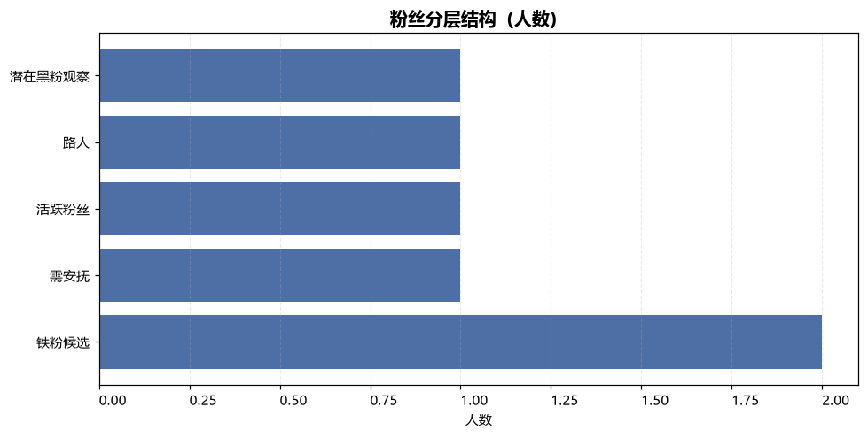
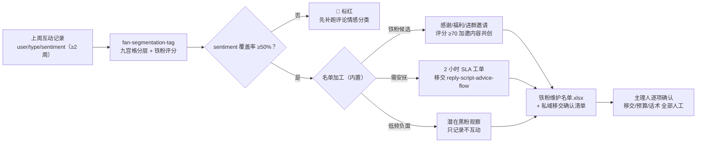

# 铁粉识别与互动名单 Superfan Identify Flow

> 工作流（T3 编排型）｜ 属于「评论运营官」 ｜ 自媒体创作者客群 ｜ 触发：定时，每周一 10:00（汇总上周互动数据后）
>
> **把上周互动记录换算成可执行的维护名单：谁该感谢、谁该安抚、谁只记录不互动——每个动作都带人工确认点。**
> 2 步编排（九宫格分层 + 名单加工）· 铁粉评分 0-100（频次 50% + 正情感率 30% + 私信深度 20%），≥70 邀内容共创 · TOP 10% 集中度基准 ≥60% · 维护容量约束（单周动作 ≤ 名单人数 ×2）· 名单直送私域转化环节供增收


🎬 **[▶ 观看高清完整版（mp4）](https://cdn.jsdelivr.net/gh/bangwozuo/engagement-ops-zh@main/workflows/superfan-identify-flow/docs/assets/demo.mp4)** — 四幕创作叙事：业务钩子 → 真实执行 → 要点到成稿演变 → 交付物

*上图来自真实执行：2 周互动数据、6 名粉丝 → 铁粉候选 2 / 需安抚 1 / 黑粉观察 1，TOP 10% 互动占比 28%（<60% 健康线，判定核心粉沉淀期），产物落盘铁粉维护名单.xlsx + segment.json。*

---

## 它编排什么（每步真实技能，DAG 与 SKILL.md 一致）

| 步骤 | 技能/环节 | 处理 | 输出 |
|---|---|---|---|
| 1 | `fan-segmentation-tag`（scripts/segment.py） | 周均互动 = 总数 ÷ 周数 → 频次档（高 ≥5/中 2-4/低 <2）× 情感档（正 ≥60%/中性/负 <40%）落九宫格；铁粉评分 = 频次 50% + 正情感率 30% + 私信深度 20% | out/segment.json + 粉丝分层清单.xlsx + 粉丝分层结构.png |
| 2 | （内置名单加工） | 铁粉候选 → 维护动作（感谢回访/专属福利/进群邀请，评分 ≥70 加邀内容共创）；需安抚 → 2 小时 SLA 工单移交 reply-script-advice-flow；潜在黑粉观察 → 只记录不互动。**全部标「待人工确认」** | out/铁粉维护名单.xlsx + superfan_flow_result.json |
| 3 | 人工确认与移交（流程终点） | 主理人逐项确认：① 名单移交私域（勾选后才建联）② 福利预算与规则报备 ③ 私信话术过 reply-script-generate 生成并确认后发送 | 移交执行（人工） |

**失败处理不静默**：上游退出码 ≠0 或产物缺失 → 中止；互动记录为空 → 「本周无互动」名单正常退出；统计周期 <2 周 → 输出噪音警告；铁粉候选为 0 → 提示检查阈值（≥5 次/周 且 正情感率 ≥60%）；疑似刷量号 → 保留明细标「待模型复核」不进名单。

### 量化规则（判定不看感觉）

- **情感标注强制检查**：sentiment 覆盖率 <50% 标红——上游没跑分类则全员按中性，铁粉识别直接失效
- **维护容量约束**：单周维护动作 ≤ 名单人数 ×2（感谢+福利），超过说明阈值该收紧（提高高频线）
- **进群分批**：邀请人数 >200 分批，避免触发平台私信任限制流

## 真实输入 → 真实输出

**输入**（`examples/input.json`，上周互动记录）：

```json
{
  "account": "@小鹿的好物日记",
  "weeks": 2,
  "interactions": [
    {"user": "奶盖不加糖", "type": "comment", "sentiment": "pos"},
    {"user": "奶盖不加糖", "type": "dm", "sentiment": "neutral"},
    {"user": "打工人小王", "type": "comment", "sentiment": "neg"}
  ]
}
```

**输出**（实跑，铁粉维护名单节选，全部待人工确认）：

| 用户 | 周均互动 | 正情感率 | 铁粉评分 | 建议动作 | 状态 |
|---|---|---|---|---|---|
| 奶盖不加糖 | 5.0 | 100% | 75.7 | 感谢回访 + 专属福利 + 进群邀请；内容共创（≥70） | 待人工确认 |
| 美妆课代表 | 5.0 | 100% | 65.7 | 感谢回访 + 专属福利 + 进群邀请（<70 不邀共创） | 待人工确认 |

**私域移交确认清单（实跑）**：铁粉名单 2 人（主理人勾选后才移交联系方式/建联）· 需安抚 1 人（2 小时 SLA 内回复，走回复工单流程）· 潜在黑粉观察 1 人（只记录不互动）。完整名单见 [`examples/output.md`](examples/output.md)；产物：



- `out/铁粉维护名单.xlsx`（名单 + 移交确认清单 + 汇总，待确认行标红）
- `out/segment.json` + `out/superfan_flow_result.json`（机器可读执行结果）

## 处理流水线（DAG）



## 快速开始

**方式一：提示词（任意 AI 工具）**

```text
1. 打开 prompt.txt，全文复制
2. 粘贴到 Coze / WorkBuddy / Dify / Claude / ChatGPT
3. 按 schema.json 的输入规格提供：互动记录（user/type/sentiment）+ 统计周数
```

**方式二：脚本（端到端编排，推荐）**

```bash
# 演示模式（内置 2 周真实样例）
python scripts/run_flow.py --demo
# 指定输入
python scripts/run_flow.py --input examples/input.json --outdir out
```

编排规则：DAG 节点 = `fan-segmentation-tag`（唯一上游统计技能）；步骤间经 JSON 衔接；模型介入刷量号复核与感谢/邀约话术生成（走 reply-script-generate）；触达动作零自动化。

## 面向谁 / 什么时候用

| ✅ 该用 | ❌ 别用 |
|---|---|
| 每周一 10:00 定时跑，把维护精力投向贡献互动大头的人 | TOP 10% 占比 <30% 时硬跑——没有核心粉丝群，先做互动钩子 |
| 铁粉名单输送给私域转化环节（为增收供弹药） | 名单外流——含粉丝昵称与互动画像，不进群、不外发，交接只说人数与结论 |
| 奶盖不加糖式高评分用户邀内容共创/试用（≥70 分） | 疑似刷量号/互赞群混入——互赞群 14 次全点赞会落「高潜互动」，必须模型复核剔除 |

## 边界与合规

- 名单标注 **「AI 生成内容」**，仅限本账号运营与私域转化环节内部使用
- 名单移交私域前必须人工确认；未经确认不得私信营销或批量拉群；确认积压 >1 周名单随下周重跑自动刷新
- 条目不存联系方式，联系方式的移交由人工在确认后进行；粉丝状态反转（如高频负面）时名单备注作废理由

## 文件地图

```text
├── README.md               ← 本文件
├── SKILL.md                ← 工作流定义（DAG / 契约 / 边界）
├── prompt.txt              ← 编排提示词（步骤明细 + 量化规则 + 失败模式）
├── schema.json             ← 输入输出契约（机器可读）
├── scripts/run_flow.py     ← 端到端编排脚本（九宫格 → 名单加工 → 移交清单）
├── examples/               ← 真实输入 + 实跑输出
├── docs/                   ← 9 项配套文档（架构 / 流程 / 场景 / 测试报告…）
└── out/                    ← 实跑产物（铁粉维护名单.xlsx / segment.json 等）
```

---

*本资产遵循 [bangwozuo 数字员工资产规范](https://github.com/bangwozuo/digital-employee-spec) v3.0 ｜ [所属员工：评论运营官](../../) ｜ [总入口](https://github.com/bangwozuo/digital-employees-hub-zh)*
