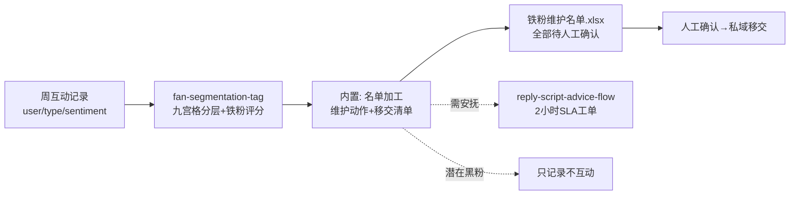

# 铁粉识别与互动名单

每周一把上周互动记录换算成**可执行的维护名单**：谁该感谢、谁该安抚、谁只记录
不互动，每个动作都带人工确认点。铁粉名单直接输送给私域转化环节，为私域增收
供弹药。

## 元信息

| 字段 | 值 |
|------|-----|
| ID | `de_media_03_wf04` |
| 类型 | **`composite`（复合技能/工作流）** |
| 所属员工 | 评论运营官 |
| 阶段 | `P1` |
| 复杂度 | `S` |
| 触发方式 | 定时（每周一 10:00） |
| ROI | 铁粉名单直接输送给 4 私域转化师，为私域增收供弹药 |
| 资产形态 | 可跑编排脚本 + 深度流程提示词（无模型调用依赖、无 API Key） |

## 编排的原子技能

| # | 原子技能 | 能力 |
|---|---------|------|
| 1 | [粉丝分层打标](../../skills/fan-segmentation-tag/) | 频次×情感九宫格 + 铁粉评分（scripts/segment.py） |

## 步骤链路（DAG）



## 步骤明细

| # | 步骤 | 技能资产 | 输入 | 输出 | 失败处理 |
|---|------|---------|------|------|---------|
| 1 | 九宫格分层 | `fan-segmentation-tag` | ≥2 周互动记录 | `out/segment.json` + 分层.xlsx | 退出码≠0 中止；空记录占位退出；周期 <2 周输出噪音警告；sentiment 覆盖率 <50% 标红 |
| 2 | 名单加工（内置） | 本流程 | segment.json | `out/铁粉维护名单.xlsx` | 上游产物缺失中止；铁粉候选为 0 标「检查阈值」；疑似刷量号标「待模型复核」不进名单 |
| 3 | 人工确认与移交 | （人工） | 名单 + 确认清单 | 已移交/已执行动作 | 积压 >1 周名单作废随下周重跑；粉丝状态反转备注作废理由 |

## 输入规格

| 字段 | 类型 | 必填 | 说明 |
|------|------|------|------|
| `interactions` | array | ✅ | 互动记录（user/type/sentiment；sentiment 来自评论情感分类） |
| `weeks` | number | ✅ | 统计周期周数（≥2，短周期高频噪音大） |
| `account` | string | ⬜ | 账号名 |

## 输出规格

| 字段 | 类型 | 说明 |
|------|------|------|
| `summary` | object | 铁粉候选 / 需安抚 / 黑粉观察数 / TOP 10% 互动占比 / 人工确认点 |
| `steps` | array | 各步骤执行状态与产物路径 |
| `deliverable` | file | `out/铁粉维护名单.xlsx`（名单 + 私域移交确认清单 + 汇总，待确认行标红） |

## 错误处理

| 情况 | 处理方式 |
|------|---------|
| 上游脚本退出码 ≠0 / 产物缺失 | 中止并打印 stderr，不静默失败 |
| 铁粉候选为 0 | 正常退出，标注「检查阈值（≥5 次/周 且 正情感率 ≥60%）或延长统计周期」 |
| 疑似刷量号/互赞群 | 保留明细标「待模型复核」，不进任何候选名单 |
| sentiment 覆盖率 <50% | 汇总标红「上游情感分类未跑，分层可信度低」 |
| 确认积压 >1 周 | 名单作废随下周重跑自动刷新 |

## 使用步骤

### 方式一：跑脚本（端到端，产出真实名单）

```bash
python3 <FLOW_DIR>/scripts/run_flow.py --input input.json --outdir out
python3 <FLOW_DIR>/scripts/run_flow.py --demo
```

### 方式二：手动编排（任意 AI 平台）

1. 用 fan-segmentation-tag 的 prompt 分层上周互动 → 得九宫格与铁粉评分
2. 按名单模板生成维护动作（评分 ≥70 加邀共创）
3. 人工逐项确认后移交：私域转化环节接手铁粉名单；需安抚养走 reply-script-advice-flow

## 验收标准

- [x] DAG 节点为本仓真实技能 slug
- [x] 步骤间 JSON 衔接，名单逐条对齐分层结果与维护动作
- [x] 全流程人工确认点齐全（移交/福利/私信）
- [x] 失败处理可演练（零候选/刷量号/情感标注缺失/产物缺失）

## 边界（不做的事）

- ❌ 不自动私信、不自动拉群、不自动发福利——触达动作零自动化
- ❌ 名单不外发、不进群；不存用户联系方式
- ❌ 不给疑似刷量号发福利；不把高频负面用户当铁粉
- ❌ 不编造互动数据；记录缺失的用户标「数据不足」不分层

## 调用示例

**输入**（`examples/input.json`，节选）：

```json
{
  "account": "@小鹿的好物日记",
  "weeks": 2,
  "interactions": [
    {"user": "奶盖不加糖", "type": "comment", "sentiment": "pos"},
    {"user": "奶盖不加糖", "type": "dm", "sentiment": "neutral"},
    {"user": "打工人小王", "type": "comment", "sentiment": "neg"}
  ]
}
```

**输出**（run_flow.py 实跑，退出码 0）：`out/铁粉维护名单.xlsx`——铁粉候选 2 /
需安抚 1 / 黑粉观察 1；奶盖不加糖评分 75.7（≥70 可邀共创）。
详见 examples/output.md。

## 所属工作流

本资产为复合技能（工作流），为独立周更流程；需安抚名单移交
`reply-script-advice-flow` 处理。

## 合规声明

- 本流程产出为 **AI 辅助名单**，移交/福利/触达全部经人工确认，输出标注 AI 生成内容
- 粉丝昵称与互动画像属用户数据，仅限本账号运营使用，名单不外发
- 平台私信任量限制由人工在执行层规避，流程不做任何自动触达

---

*本技能遵循 [bangwozuo 数字员工资产规范](https://github.com/bangwozuo/digital-employee-spec) v3.0*
