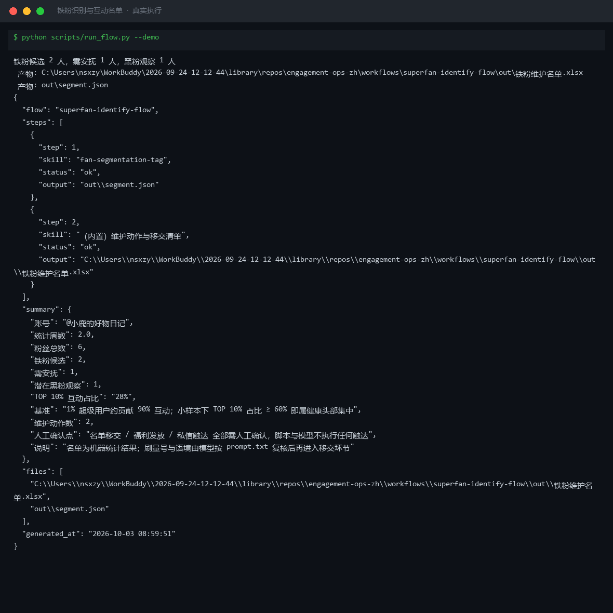

# 截图与录屏

> 以下素材均来自**真实执行**：`--run` 实拍终端 / 实跑产物文件，无摆拍。

## 演示视频


*第二帧为实跑产物图表*

## 执行截图



## 实跑产物

| 文件 | 说明 |
|---|---|
| [`out/_demo_input.json`](out/_demo_input.json) | 结构化结果（实跑生成） · 4 KB |
| [`out/segment.json`](out/segment.json) | 结构化结果（实跑生成） · 3 KB |
| [`out/superfan_flow_result.json`](out/superfan_flow_result.json) | 结构化结果（实跑生成） · 1 KB |
| [`out/粉丝分层清单.xlsx`](out/粉丝分层清单.xlsx) | Excel 工作簿（实跑生成） · 8 KB |
| [`out/粉丝分层结构.png`](out/粉丝分层结构.png) | 图表产物（实跑生成） · 30 KB |
| [`out/铁粉维护名单.xlsx`](out/铁粉维护名单.xlsx) | Excel 工作簿（实跑生成） · 8 KB |


---

## 附录：实跑输出明细

> 本资产为纯提示词客户端资产，无界面可截图。以下为**实跑运行效果**。

## 运行效果

### 输入

```json
{
  "input": "请提供工作流的初始输入数据"
}

```

### 输出

## 执行摘要

本次执行因缺少有效初始输入数据，工作流在入口阶段即提示补充信息，未进入粉丝分层打标技能的处理环节。

## 分步结果

1. 步骤 1（粉丝分层打标）：检测到输入为占位符"请提供工作流的初始输入数据"，无法执行评分与分层，已返回提示信息要求补充待评估记录与维度权重。

## 最终交付物

> **待补充信息**：请提供粉丝互动记录（records，如消费次数、互动频次、情感倾向评分）以及维度与权重（dimensions，可选）和分层阈值（thresholds，可选），以便执行铁粉识别与互动名单工作流。

*AI 生成内容*


---

*运行效果由实跑验证生成*
